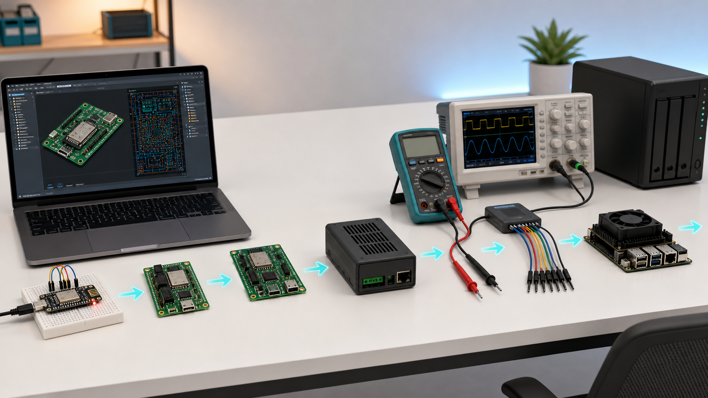
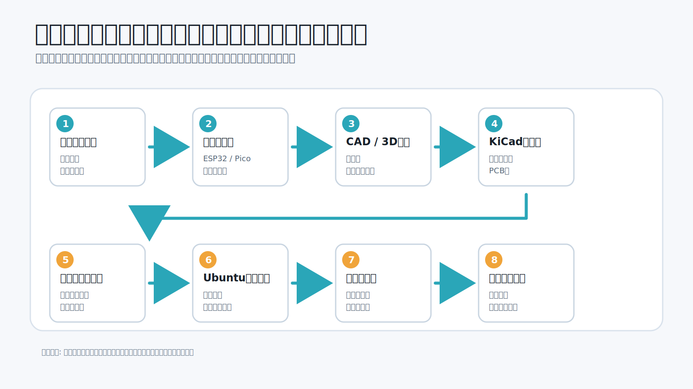
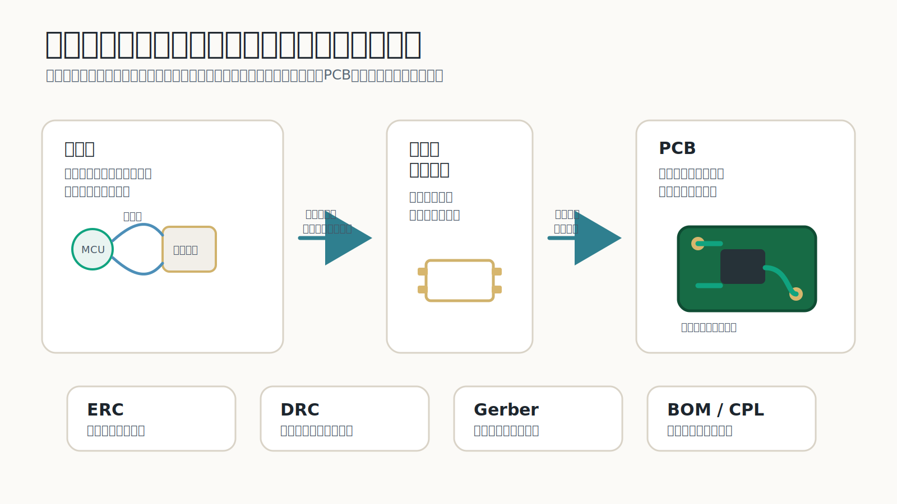
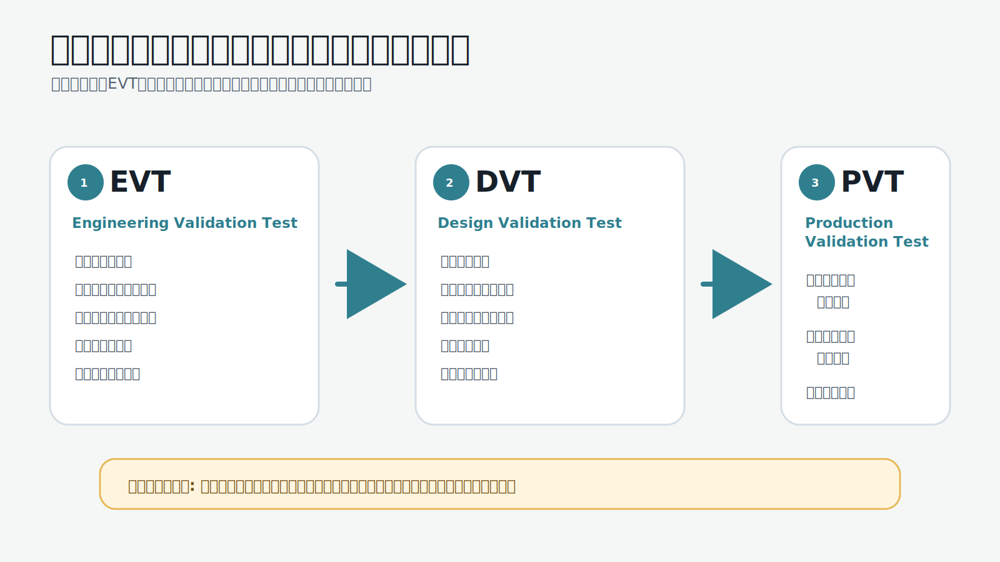
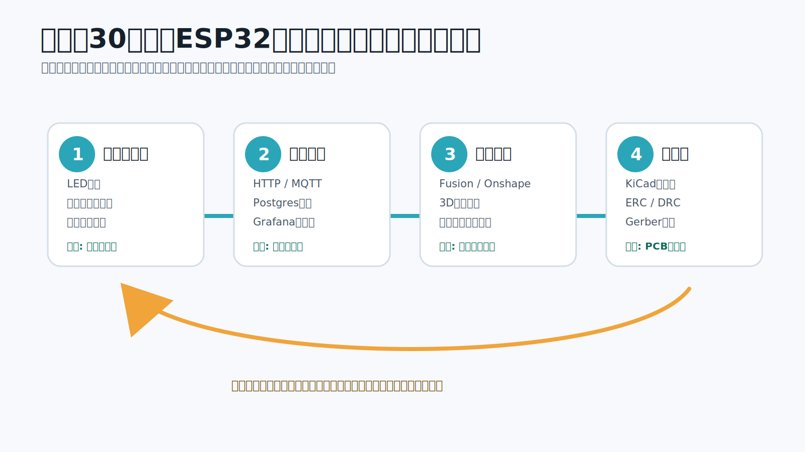

# 2026-05-18

今日はもう一つ、ハードウェア開発について調べた。

気になっているのは、AutoCAD、Ubuntu、サーバー、3Dプリンター、基板設計、NVIDIA Jetson、検証、製品化あたり。

自分でハードウェアを作りたいと思っても、最初に何をすればいいのか分からない。基板をどう設計するのか、どうテストするのか、どの機材を買えばいいのか、NVIDIAのドキュメントに何か書いてあっても前提知識が多すぎて読めない。そういう情報格差が、そのまま心理的ハードルになっている。

調べてみて思ったのは、ハードウェア開発は「全部を理解してから始めるもの」ではないということ。

むしろ、既製の開発キット、既製のCAD、既製の基板製造サービス、既製の測定器、既製の認証済みモジュールを使って、不確実性を一つずつ潰していく仕事だと思った。

ソフトウェアと違って、ハードウェアは物理的に壊れる。煙が出る。部品が届かない。ネジ穴が0.5mmずれる。無線や電源の法規制がある。だから怖く見える。

でも、工程に分けると見え方が変わる。

ハードウェア開発は、魔法ではなくパイプラインだった。

まず、全体像はこんなイメージ。



この画像で大事なのは、どれか一つの機材が主役ではないということ。

開発ボードで動かす。CADで形を見る。基板にする。測定器で確認する。Jetsonやサーバーにつなぐ。これらを順番に回して、分からない部分を減らしていく。

## 全体像

ハードウェア開発は、大きく分けると次の流れになる。

1. 何を作るか決める
2. 既製の開発ボードで動かす
3. 3D CADで筐体や治具を作る
4. 回路図を書く
5. 基板を設計する
6. ファームウェアを書く
7. Ubuntuやサーバー側でログ、設定、更新、可視化を作る
8. 試作基板を発注する
9. 電源投入前の検査をする
10. Bring-upする
11. 機能、耐久、温度、電源、通信を検証する
12. 小ロットで作る
13. 認証、量産、保守、返品対応まで考える

この流れを図にすると、かなり分かりやすい。



最初から全部をやろうとすると重い。

でも、最初の一歩はかなり小さくできる。

例えば、ESP32の開発ボードにセンサーをつなぎ、Wi-FiでUbuntuサーバーにログを送る。3Dプリンターで小さいケースを作る。うまく動いたら、その回路だけをKiCadで基板化する。

これだけで、センサー、ファームウェア、通信、サーバー、筐体、基板、テストの最小ループを一周できる。

重要なのは、いきなり「製品」を作らないこと。

最初に作るべきなのは、製品ではなく「開発の流れを練習するための小さいハードウェア」だと思う。

## CADはAutoCADだけではない

ハードウェア開発でCADと言うと、最初にAutoCADを思い浮かべがちだけど、製品開発の入口としてはAutoCADだけを見ない方がいい。

AutoCADは図面作成や2D製図に強い。一方で、自分で小さい装置、筐体、治具、基板とケースの組み合わせを作るなら、最初はFusion、Onshape、FreeCADのような3D CADの方が分かりやすい。

Autodesk Fusionは、機械設計、電子回路、PCB、製造データの出力までを一つの環境で扱える。Fusion Electronicsの公式ドキュメントでも、回路図、PCBレイアウト、3D PCB、製造ファイル生成までがワークフローとして説明されている。

初心者にとって大事なのは、綺麗な図面を描くことではない。

基板がケースに入るか。コネクタに指が届くか。USBケーブルが刺さるか。ネジで固定できるか。熱が逃げるか。現場で落としても壊れにくいか。

このあたりを見えるようにするのが3D CADの役割。

ロボットや物理AIの領域では、CADとシミュレーションの接続も進んでいる。PTCは2026年3月に、OnshapeとNVIDIA Isaac Simを接続するワークフローを発表している。CAD上の機械構造をシミュレーション側へ渡し、設計変更に応じてシミュレーションも更新するという方向。

これは、今後のハードウェア開発では「CADで形を作る」と「仮想空間で動かして検証する」がもっと近づくということだと思う。

ただし、最初からそこまで行く必要はない。

初心者はまず、FusionかOnshapeで小さいケースを作り、3Dプリンターで出し、基板やセンサーが本当に入るか確認するだけでいい。

## 基板設計はKiCadから始める

「基盤」ではなく、電子回路の板は「基板」と書く。

基板設計で最初に触るなら、KiCadがかなり良さそう。オープンソースで、回路図、PCBレイアウト、部品ライブラリ、Gerber出力、ERC、DRCまで一通りできる。

KiCad 9.0の公式ドキュメントでは、PCBは回路図、つまりネットリストの物理実装として説明されている。さらに製造出力としてGerber、pick-and-place、PDF図面などを出す流れがある。KiCad 9.0ではjobsetsも入り、製造ファイル生成やERC/DRCをまとめて実行しやすくなっている。

初心者が覚えるべき言葉は、まずこれだけでいい。

- 回路図: どの部品のどのピンがつながるかを書く設計図
- フットプリント: 実際の部品を基板上に置くための足形
- ネット: 電気的につながっている線の名前
- ERC: 回路図としておかしいところを見つけるチェック
- DRC: 基板として製造できないところを見つけるチェック
- Gerber: 基板工場に渡す製造ファイル
- BOM: 部品表
- CPL: 部品をどこに置くかを示す配置ファイル

図で見ると、回路図、フットプリント、PCB、製造ファイルの関係はこうなる。



この言葉が分かると、基板設計は少し怖くなくなる。

やることは、こういう順番。

1. まず開発ボードで回路を動かす
2. データシートの推奨回路を読む
3. KiCadで回路図を書く
4. ERCを通す
5. 各部品にフットプリントを割り当てる
6. PCB上に部品を置く
7. 電源、GND、信号線を配線する
8. DRCを通す
9. Gerber、BOM、CPLを出す
10. JLCPCBやPCBWayのプレビューで確認する
11. 発注する

最初の基板でやってはいけないのは、いきなり高密度、多層、高速信号、独自電源、無線アンテナ、USB-C PD、リチウム電池充電を全部入れること。

最初は2層基板でいい。ESP32やRaspberry Pi Picoのような開発ボードをそのまま載せる形でもいい。センサーやLEDやボタンだけを周辺基板にするのでもいい。

つまり、最初の基板は「自分の回路設計能力を証明するもの」ではなく、「基板発注とBring-upの流れを覚えるもの」でいい。

## AI時代の基板設計

AI時代のハードウェア開発で面白いのは、PCB設計にもAI支援が入ってきていること。

Fluxは、回路図、部品、接続、BOMを理解するAIアシスタントをPCBエディタに統合している。部品選定、データシートの読み取り、設計フィードバック、回路図変更の補助までを狙っている。

Quilterは、PCBレイアウトをAIと物理ベース最適化で自動化する方向のツール。公式ドキュメントでは、部品配置、配線、DRC、物理シミュレーションを含む自動レイアウトサービスとして説明されている。

この流れはかなり大きい。

ただし、今の段階でAIに丸投げしてはいけないと思う。

回路は、嘘をつくと物理的に壊れる。LLMはもっともらしく部品を勧めたり、存在しないピン名を出したり、データシートの条件を取り違えたりすることがある。

だからAIの使い方はこうする。

- 部品候補を出してもらう
- データシートの重要箇所を要約してもらう
- 回路図のリスクをレビューしてもらう
- 電源、GND、プルアップ、保護回路のチェックリストを作ってもらう
- KiCadのERC/DRCエラーの意味を説明してもらう
- JLCPCBに出す前の確認リストを作ってもらう
- Bring-up手順を作ってもらう

最終判断は、人間が一次情報に戻って行う。

AIは、情報格差を減らす先生として使う。責任者として使わない。

## ファームウェアはArduinoから入ってESP-IDFかZephyrへ進む

電子工作の最初の一歩はArduinoでいい。

LEDを点滅させる。ボタンを読む。温度センサーを読む。シリアルにログを出す。ここまではArduinoの抽象化が心理的ハードルを下げてくれる。

ただ、製品に近づくなら、次にESP-IDFやZephyrを見るとよさそう。

ESP-IDFはEspressifの公式IoT開発フレームワークで、ESP32のWi-Fi、Bluetooth、電源管理、周辺機能を扱える。公式のGetting Startedでは、ツールチェーン、CMake/Ninja、ESP-IDF本体を入れて、ビルド、書き込み、モニターまで進める流れになっている。

PlatformIOは、VS Code上で組み込み開発をしやすくする環境。公式ドキュメントでは、1000以上のボード、40以上の開発プラットフォーム、20以上のフレームワーク、デバッグ、リモート開発、ユニットテスト、シリアルモニタなどがまとまっている。

Zephyrは、より本格的なRTOS。公式Getting StartedはUbuntu、macOS、Windowsに対応し、ビルド、フラッシュ、サンプル実行、ハードウェアデバッグまでの流れを用意している。

初心者の順番としては、こうでいいと思う。

1. Arduinoでハードウェアの感覚をつかむ
2. PlatformIOでプロジェクト管理、ライブラリ、シリアルモニタに慣れる
3. ESP32製品ならESP-IDFに進む
4. 複数メーカーのMCUやRTOS設計が必要ならZephyrを見る

いきなりZephyrから入ると、抽象概念が多くてつらい。最初はLED、ボタン、センサー、ログでいい。

## Ubuntuとサーバーは開発の背骨になる

ハードウェア開発でUbuntuやサーバーが出てくる理由は、単にLinuxを触りたいからではない。

ハードウェアは、動かしたあとにログを取り、ファームウェアを配り、設定を管理し、テスト結果を残し、異常を検知する必要がある。

その背骨としてUbuntu Serverを使う。

Ubuntu Serverの公式ドキュメントでは、小さい仮想マシンから大規模サーバーまで幅広いハードウェアで動く柔軟なベースとして説明されている。開発環境としては、Ubuntu 24.04 LTSを基準にしておくとよさそう。

サーバー側では、Docker Composeを使うと、API、DB、MQTT、Grafana、ログ収集などをまとめて立ち上げられる。Docker公式ドキュメントでも、Composeは複数コンテナのアプリをYAMLで定義し、開発、テスト、CIで使えると説明されている。

ハードウェア開発でのサーバーは、こう使う。

- センサーデータを受けるAPI
- MQTTブローカー
- ログ保存用のPostgres
- 可視化用のGrafana
- ファームウェア配信用の小さいHTTPサーバー
- テスト結果の保存
- GitHub Actionsのself-hosted runner

特に重要なのは、実機テストを自動化すること。

ハードウェアは、PC上のユニットテストだけでは足りない。実際の基板をUSBでつなぎ、ファームウェアを書き込み、センサーを読み、通信し、ログを保存する必要がある。

だから、Ubuntuマシンを一台「ラボサーバー」にする。

そこに測定器、USBハブ、開発ボード、カメラ、電源、GitHub Actions runnerをつなぐ。これができると、ソフトウェアのCIに近い感覚で、ハードウェアの一部も検証できる。

## NVIDIA Jetsonは最初から基板化しない

NVIDIA Jetsonは、カメラ、ロボット、エッジAI、現場推論をやるなら強い。

ただし、初心者が最初からJetson向けの独自基板やキャリアボードを作るのは重い。

NVIDIAのJetson公式ドキュメントでは、JetPackを使ってDeveloper KitにOSイメージをフラッシュし、開発ツール、ライブラリ、API、サンプル、ドキュメントを入れる流れが説明されている。Jetson LinuxもリリースごとにDeveloper GuideとRelease Notesが分かれている。

つまりJetsonは、PCというより「NVIDIAが用意したソフトウェアスタック込みの開発プラットフォーム」と見た方がいい。

最初にやることは、こう。

1. Jetson Orin NanoなどのDeveloper Kitを買う
2. 公式手順でJetPackを入れる
3. USBカメラやCSIカメラをつなぐ
4. サンプルを動かす
5. Dockerで環境を固定する
6. モデル推論のログを取る
7. 温度、消費電力、メモリ使用量を見る
8. 必要なI/Oだけ外付け基板で足す

独自キャリアボードは、かなり後でいい。

最初から作るべきなのはJetson基板ではなく、Jetsonを使った検証環境。カメラ、照明、固定具、電源、ログ、温度、推論速度を測れる環境を先に作る。

## 3Dプリンターは筐体より治具に効く

3Dプリンターは、完成品の筐体を作るためだけのものではない。

むしろ最初は、治具に使うのが良いと思う。

- センサーを固定する治具
- カメラの角度を決める治具
- 基板を机に固定する治具
- ボタン位置を試す仮筐体
- ネジ穴の位置確認
- ケーブルの逃げ確認
- 現場設置のブラケット

Prusaの公式ナレッジベースでは、FFFプリンターではFirst Layer Calibrationが必要で、最初の層が重要だと説明されている。3Dプリンターは買って終わりではなく、材料、ノズル、ベッド、温度、積層方向、寸法誤差を調整する道具。

ただ、最近のBambu LabやPrusaのプリンターは、初心者でもかなり扱いやすくなっている。だから、最初はプリンター自体の改造にハマるより、開発を進めるための治具を作る方がいい。

ハードウェア開発で3Dプリンターがあると、物理の確認速度が一気に上がる。

基板が届く前にケースを試せる。コネクタ位置を確認できる。現場に持って行く前に持ちやすさを確認できる。

これは、心理的ハードルをかなり下げる。

## 測定器は恐怖を消す道具

ハードウェアが怖い理由の一つは、見えないから。

電圧は見えない。電流も見えない。I2CやSPIの通信も見えない。だから、動かないときに何が起きているか分からない。

測定器は、その見えなさを消す道具。

最初に揃えるなら、この順番が良さそう。

1. デジタルマルチメーター
2. 電流制限できる安定化電源
3. USB-C電力計
4. ロジックアナライザ
5. オシロスコープ
6. サーモカメラ
7. ノギス
8. はんだごて、フラックス、ピンセット、拡大鏡

ロジックアナライザは、I2C、SPI、UARTのデバッグに効く。SaleaeのLogicはプロトコルデコーダ、検索、計測、拡張があり、さらにLogic 2はMCPでClaudeやCodexから自然言語操作できるようになっている。これはAI時代のハードウェアデバッグとしてかなり象徴的。

安く始めるなら、sigrok/PulseView対応のロジックアナライザでもいい。PulseViewはロジックアナライザやオシロスコープ用のGUIで、プロトコルデコードにも対応している。

オシロスコープは最初から高級機でなくてもいい。Digilent Analog Discovery 3のようなUSB測定器は、オシロスコープ、ロジックアナライザ、波形生成、パターン生成、電源などをまとめて持てる。公式情報では、WaveFormsソフトウェアがWindows、Mac、Linuxに対応し、125 MS/sのサンプリングもできる。

測定器を持つ意味は、プロっぽくなることではない。

「たぶん動いている」を「何V出ている」「何mA流れている」「このタイミングでI2CがNACKしている」に変えること。

これが心理的ハードルを消す。

## 検証はEVT、DVT、PVTで考える

ハードウェア開発で大事なのは、作ることより検証すること。

検証は大きく3段階で考えると分かりやすい。

EVTはEngineering Validation Test。

そもそも動くのかを見る段階。電源が入るか、ファームウェアが書けるか、センサーが読めるか、通信できるか、ケースに入るかを見る。

DVTはDesign Validation Test。

設計として十分かを見る段階。温度、落下、振動、電源変動、長時間稼働、Wi-Fi切断、ノイズ、ユーザーの誤操作などを見る。

PVTはProduction Validation Test。

量産できるかを見る段階。同じ品質で組み立てられるか、部品が安定して手に入るか、検査治具で短時間にテストできるか、シリアル番号やファームウェア書き込みの流れがあるかを見る。

EVT、DVT、PVTは、いきなり全部やるものではなく、検証の深さが増えていく段階として見ると分かりやすい。



初心者は、まずEVTだけでいい。

ただし、EVTでもチェックリストを作る。

- 目視でショートや部品向きの間違いを見る
- 電源投入前にGNDと電源の抵抗を見る
- 電流制限を低めにして電源を入れる
- 各電源レールを測る
- マイコンに書き込めるか確認する
- UARTログを見る
- I2C/SPI/UARTをロジックアナライザで見る
- センサー値を実データで確認する
- 10分、1時間、24時間の連続稼働を見る
- ケースに入れて熱とケーブルを確認する

これだけでも、ただ作って終わりではなくなる。

## 製造に出す前に見ること

基板製造サービスは、心理的ハードルを大きく下げてくれる。

JLCPCB、PCBWay、Seeed Fusionのようなサービスを使えば、個人でも基板を作れる。JLCPCBのドキュメントを見ると、BOMとCPLのリファレンス番号を一致させること、表裏の配置データを正しく入れること、座標単位を揃えることなど、かなり実務的な注意点が並んでいる。

つまり、基板製造で失敗しやすいのは、難しい理論だけではない。

R1とr1の表記違い。BOMにはあるのにCPLにない。部品の向きが違う。座標単位が違う。部品の在庫がない。フットプリントが違う。こういう地味なミスで失敗する。

だから、製造前チェックリストを作る。

- ERCが通っている
- DRCが通っている
- 電源とGNDのショートがない
- フットプリントと実部品のデータシートが合っている
- コネクタの向きが合っている
- ダイオード、LED、ICの1番ピンが合っている
- テストポイントがある
- 基板固定穴がある
- USBやアンテナの周りに余裕がある
- BOMとCPLのリファレンス番号が一致している
- 部品が実際に購入可能
- 代替部品を考えている
- Gerberビューアで全層を見た
- 基板外形がケースと合っている

AIには、このチェックリストを毎回作らせるといい。

ただし、最終確認はGerberビューア、KiCad、製造サービスのプレビュー、人間の目で行う。

## 製品化では認証と保守が出てくる

自分用の試作と、販売する製品は別物。

販売するなら、電源、安全、無線、EMC、表示、説明書、保証、返品、修理、ファームウェア更新まで考える必要がある。

日本で電源周りを扱うならPSEが関係する場合がある。経産省の説明では、電気用品安全法の対象品目にはAC/DC電源装置や延長コードなどが含まれ、対象製品は技術基準適合、自己検査、PSE表示などの義務がある。

無線を使うなら技適が関係する。JQAの説明では、特定無線設備は登録証明機関の証明を受け、技適マークを表示することで免許手続きの特例を受けられる。

EUに売るならCE、米国に売るならFCCの確認が必要になる。EUの公式ページでは、CE markingは対象となるEU規則がある製品に必要で、メーカーが適合責任を持つと説明されている。FCCの規則でも、RF機器は認可前の販売や運用に制限がある。

ここで初心者が取るべき戦略は、認証済みモジュールを使うこと。

- 電源は認証済みACアダプタを使う
- Wi-Fi/Bluetoothは技適やFCC/CE対応済みモジュールを使う
- リチウム電池充電は実績のあるモジュールから始める
- 高電圧やAC直結は最初に扱わない
- 無線アンテナを自作しない

製品化の難しさは、ハードウェアを動かすことだけではない。

同じものを何十台、何百台と作り、壊れたときに原因が追え、ファームウェアを更新でき、返品や交換に対応できる状態を作ること。

つまり、製品化とは「動くものを作る」ではなく「繰り返し作れて、運用できるものにする」こと。

## 最初の30日でやるなら

初心者が心理的ハードルをなくすには、最初の30日で小さい開発ループを一周するのがいい。

作る題材は、ESP32センサーロガーが良さそう。

ESP32に温湿度センサーとLEDをつなぐ。Wi-FiでUbuntuサーバーにデータを送る。Grafanaで見る。3Dプリンターで小さいケースを作る。最後にKiCadで小さい基板を作る。

30日の流れを図にするとこうなる。



これなら、ハードウェア開発の主要要素がほぼ全部入る。

1週目は、開発ボードで動かす。

ESP32、温湿度センサー、ブレッドボード、USBケーブルを買う。ArduinoかPlatformIOでLED点滅、センサー読み取り、シリアルログまでやる。

2週目は、サーバーにつなぐ。

Ubuntu ServerかローカルMac上のDocker Composeで、MQTTかHTTP API、Postgres、Grafanaを立てる。ESP32からデータを送る。ログを保存する。

3週目は、物理形状を作る。

FusionかOnshapeでケースを作る。3Dプリンターで出す。基板、USB、センサー穴、ネジ穴、ケーブル逃げを確認する。

4週目は、基板化する。

KiCadで回路図とPCBを作る。ERC、DRCを通す。Gerber、BOM、CPLを出す。製造サービスのプレビューを見る。発注する。

基板が届いたら、Bring-upチェックリストに沿って電源投入、ファーム書き込み、センサー確認、長時間稼働をする。

この一周をやれば、かなり怖さが消えるはず。

## AIに聞くべき質問

AI時代のハードウェア開発では、質問の仕方がかなり大事になる。

良い質問は、AIに作業を丸投げしない。前提、対象、制約、欲しい出力を明確にする。

例えば、こう聞く。

```text
ESP32で温湿度センサーを読む小型基板を作ります。
初心者がKiCadで回路図を書く前に確認すべき電源、I2C、プルアップ、ESD、テストポイントのチェックリストを作ってください。
各項目について、なぜ必要か、どのデータシート項目を見るべきかも書いてください。
```

```text
この部品のデータシートを前提に、Recommended Operating Conditions、Absolute Maximum Ratings、電源投入順序、デカップリングコンデンサ、I2Cアドレス、プルアップ抵抗の注意点を抜き出してください。
不明点は推測せず、不明と書いてください。
```

```text
KiCadのERC/DRCエラー一覧を貼ります。
製造前に必ず直すべきもの、警告として確認すべきもの、今回の設計では許容できる可能性があるものに分類してください。
```

```text
初回基板のBring-up手順を作ってください。
電源投入前、電源投入時、ファーム書き込み、通信確認、センサー確認、長時間試験の順で、測定器と合格条件も入れてください。
```

```text
JLCPCBにPCBAを発注する前の確認リストを作ってください。
Gerber、BOM、CPL、部品向き、フットプリント、在庫、テストポイント、基板外形、ケース干渉を含めてください。
```

AIは、先輩エンジニアに壁打ちする感覚で使う。

でも、データシート、公式ドキュメント、製造サービスのルール、法律や認証の確認は必ず一次情報に戻る。

## zerotryへの応用

この考え方は、zerotryにもかなり関係する。

RFID導入をやっていると、ソフトウェアだけでは終わらない。タグ、リーダー、プリンター、現場の棚、検品台、物流拠点、電源、ネットワーク、作業者の動線まで絡む。

つまり、zerotryが強くなるには、ハードウェア開発そのものを内製できるかどうかだけではなく、ハードウェア検証の型を持てるかが重要になる。

例えば、RFIDリーダーの固定治具を3Dプリンターで作る。タグ発行プリンターの設置台を作る。検品台のセンサー位置を試す。Jetsonやカメラを使って、タグ貼り作業の検知や現場映像の解析をする。Ubuntuサーバーでログを集める。測定器で電源や通信を見える化する。

これらは全部、現場導入の摩擦を減らすためのハードウェア開発になる。

最初から自社基板を作る必要はない。

まずは、既製品、開発キット、3Dプリント治具、Ubuntuログ基盤、AIレビュー、チェックリストを組み合わせる。それで現場の不確実性を減らす。

その上で、何度も同じ課題が出るなら、そこで初めて専用基板や専用筐体を作る。

この順番が良さそう。

## 私たちの見解

今日調べて分かったのは、ハードウェア開発の心理的ハードルは、知識不足だけから来ているわけではないということ。

本当のハードルは、全体像が見えないこと。

CAD、基板、ファームウェア、Ubuntu、サーバー、3Dプリンター、測定器、製造、認証がバラバラに見えるから怖い。

でも実際には、それぞれはパイプラインの部品だった。

3D CADは形と干渉を確認するため。KiCadは回路を基板にするため。ESP-IDFやPlatformIOはファームウェアを再現可能にするため。UbuntuとDocker Composeはログとテスト環境を作るため。JetsonはエッジAIを現場で動かすため。3Dプリンターは治具と筐体を素早く試すため。測定器は見えない電気を見えるようにするため。製造サービスは個人でも基板を作るため。認証済みモジュールは製品化のリスクを下げるため。

AI時代に効率化できるのは、主に「調べる」「比較する」「チェックリスト化する」「ログを読む」「テスト手順を作る」「レビューする」部分。

でも、AIが物理法則を肩代わりしてくれるわけではない。

電源は間違えたら壊れる。部品の向きが逆なら動かない。ケースの穴がずれたら刺さらない。無線や電源の認証は避けられない。

だからこそ、AIを使って心理的ハードルを下げながら、実物を小さく作り、測り、記録し、改善する。

ハードウェア開発を始めるために必要なのは、最初から完璧な知識を持つことではない。

必要なのは、小さい開発ループを一周すること。

開発ボードで動かす。サーバーに送る。ケースを出す。基板にする。測る。壊れた理由を記録する。次の版で直す。

このループを持てば、ハードウェアは急に「分からない巨大な世界」ではなくなる。

ハードウェア開発は、才能ではなく、摩擦を一つずつ消す工程だと思う。

## 参考にした資料

- [KiCad 9.0 Documentation](https://docs.kicad.org/9.0/en/introduction/introduction.html)
- [Autodesk Fusion Electronics overview](https://help.autodesk.com/view/fusion360/ENU/?contextId=ECD-OVERVIEW)
- [Autodesk Fusion Electronics workflow](https://help.autodesk.com/view/fusion360/ENU/?contextId=ECD-PROJECTS)
- [Ubuntu Server system requirements](https://ubuntu.com/server/docs/reference/installation/system-requirements/)
- [Docker Compose docs](https://docs.docker.com/compose)
- [GitHub Docs: Self-hosted runners](https://docs.github.com/en/actions/concepts/runners/self-hosted-runners)
- [NVIDIA Jetson Software Documentation](https://docs.nvidia.com/jetson/index.html)
- [PlatformIO IDE documentation](https://docs.platformio.org/en/latest/integration/ide/pioide.html)
- [ESP-IDF Get Started](https://docs.espressif.com/projects/esp-idf/en/stable/esp32/get-started/index.html)
- [Zephyr Getting Started Guide](https://docs.zephyrproject.org/latest/develop/getting_started/index.html)
- [JLCPCB BOM / CPL preparation](https://jlcpcb.com/help/article/advice-for-bom-and-cpl-files-preparation)
- [JLCPCB PCBA Technical Guidelines](https://jlcpcb.com/help/catalog/181-PCBA-Technical-Guidelines)
- [Digilent Analog Discovery 3](https://digilent.com/shop/analog-discovery-3/)
- [Saleae Logic](https://www.saleae.com/logic)
- [sigrok PulseView](https://www.sigrok.org/wiki/PulseView)
- [Flux AI-Powered PCB Design Assistant](https://www.flux.ai/COPILOT)
- [Quilter Introduction](https://docs.quilter.ai/using-quilter/introduction)
- [OSHWA Open Source Hardware Basics](https://certification.oshwa.org/basics.html)
- [METI Electrical Appliances and Materials Safety Act](https://www.meti.go.jp/english/policy/economy/consumer/pse/index.html)
- [EU CE marking](https://europa.eu/youreurope/business/product-requirements/labels-markings/ce-marking/index_en.htm)
- [FCC equipment authorization related rules](https://docs.fcc.gov/public/attachments/FCC-10-197A1.pdf)
- [JQA 電波法](https://www.jqa.jp/service_list/safety/service/mandatory/radio/)
- [Prusa Basic calibration](https://help.prusa3d.com/category/basic-calibration_228)
