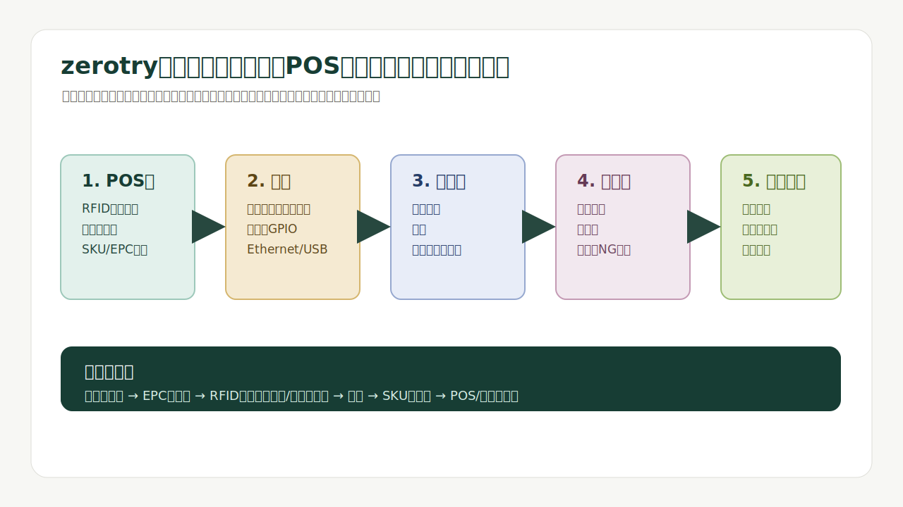
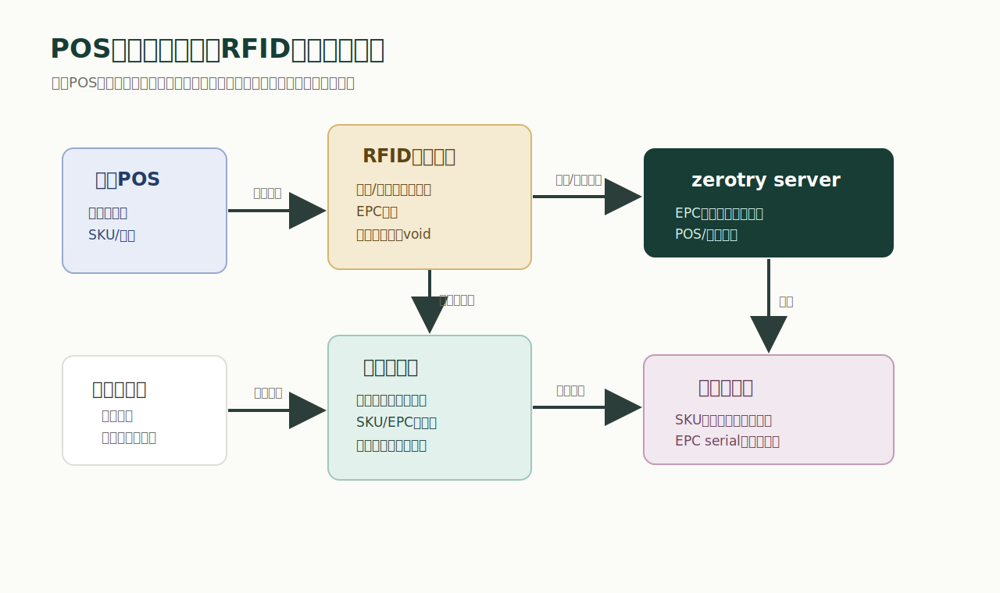
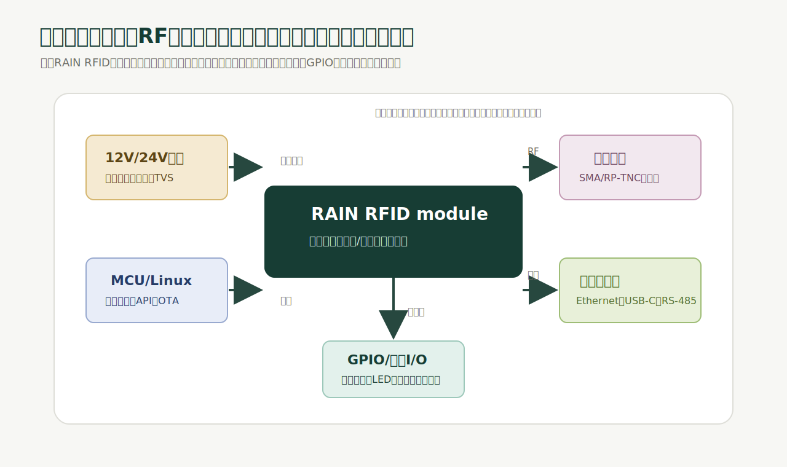
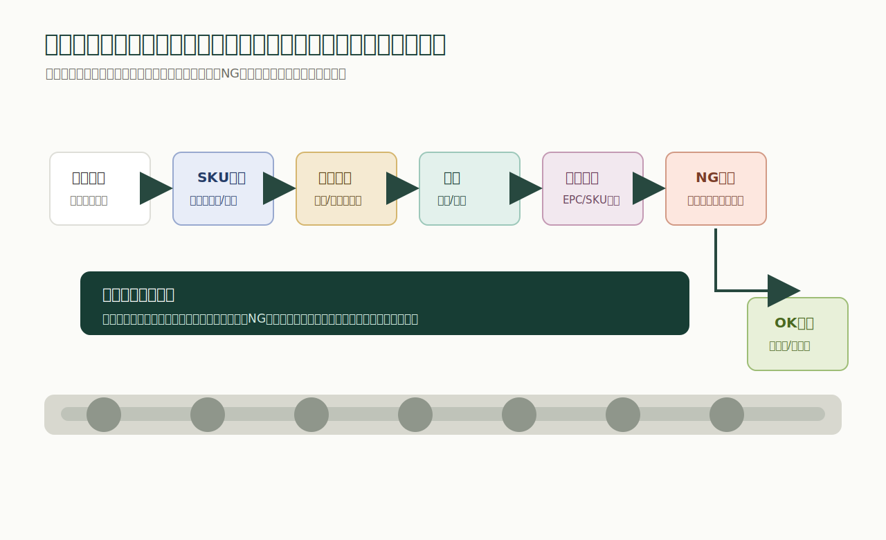
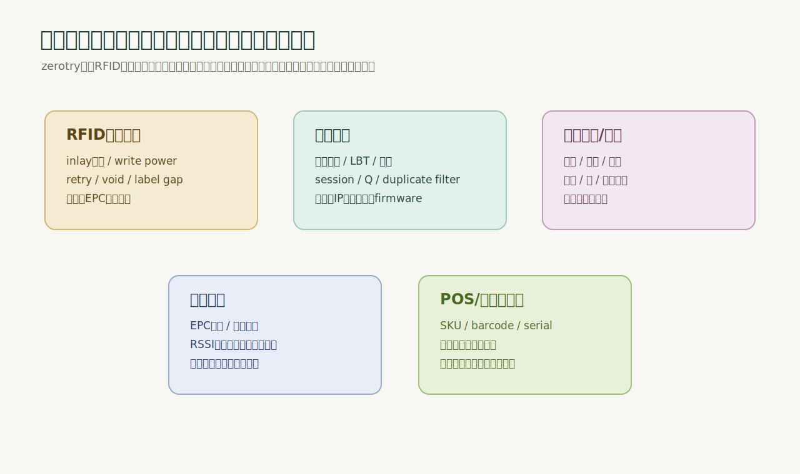
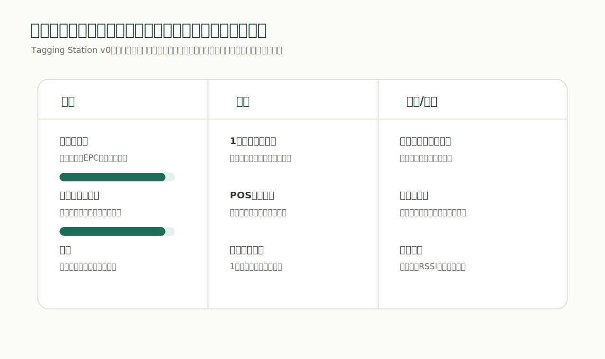

# 2026-05-18

次に考えたいのは、zerotryとしてどんなハードウェアを開発していくか。

今の関心は、タギングを自動化するロボット、もしくはラインを構築すること。リーダーモジュールも作りたいし、そのための基板も作りたい。入口としては、POSレジの周辺から始めるのが現実的だと思っている。

調べて整理すると、zerotryが最初に作るべきものは「ロボットそのもの」ではなく、商品にIDを付け、読み取り、POSや在庫データに接続するための小さいハードウェア群だと思った。

言い換えると、zerotryが作るべきなのは、現場の物理商品をデータ化するための装置。

その最初のプロダクトは、POS横に置けるRFIDタグ発行・読取・検査ステーションでいい。

## 結論

zerotryのハードウェア開発は、この順番がいい。

1. POS横のRFIDタグ発行・読取ステーション
2. 既製リーダーモジュールを載せるzerotryリーダー基板
3. プリンタ、読取器、治具を組み合わせた半自動タギングワークセル
4. コンベア、センサー、貼付機、検査リーダーを組み合わせたタギングライン
5. タグ位置や商品姿勢が安定してから、ロボットアームやAMRに進む

最初からロボットを作らない。

理由は、ロボットの前に決めるべきことが多すぎるから。

どのタグを使うのか。商品マスタとEPCをどう紐づけるのか。RFIDプリンタで正しくエンコードできるのか。商品に貼ったあと読めるのか。金属や液体の商品で読取率が落ちないか。POSで読み取った時に二重読取や読み漏れが起きないか。

ここが固まらないままロボットを作ると、問題の原因が分からなくなる。

ロボットの軸が悪いのか。タグ位置が悪いのか。アンテナが悪いのか。出力設定が悪いのか。EPCの採番が悪いのか。POS連携が悪いのか。全部が同時に疑わしくなる。

だから、最初に作るべきなのは「タグを発行し、貼り、読み、データにする最小ループ」。

## POSから始める理由

POSは、ハードウェア開発の入口としてかなり良い。

POSには、すでに商品マスタ、SKU、バーコード、価格、会計、返品、店舗オペレーションがある。つまり、物理商品とデータの接点が最初から存在している。

zerotryがいきなり決済端末を作る必要はない。SquareやShopify POSのような既存POSは、バーコードスキャナ、レシートプリンタ、キャッシュドロワー、カードリーダーなどの周辺機器を前提にしている。Shopify POSは対応バーコードスキャナで商品をカートに追加できるし、SquareはTerminal APIでSquare Terminalを既存のWeb/モバイルアプリから使える。

つまり、最初の狙いは「POSを置き換えること」ではない。

POSの横に置く装置として入り、商品の識別をバーコードからRFIDへ広げる。

最小構成はこれでいい。

- 既存POS
- バーコードスキャナ
- RFIDプリンタ/エンコーダ
- 卓上RFID読取パッド
- 小さいエッジPC、またはUbuntuサーバー
- zerotryの商品マスタ、EPC採番、読取ログ、検査画面

ユーザーの作業はこうなる。

1. POSまたは管理画面で商品を選ぶ
2. zerotryがEPCを発行する
3. RFIDプリンタが文字、バーコード、RFIDを同時に出す
4. 商品にタグを貼る
5. 読取パッドで読み、EPCとSKUの対応を検査する
6. POSや在庫システムに「この商品はRFID化済み」と記録する

これだけで、ロボットなしでも価値が出る。

店舗ではタグ作成のミスが減る。在庫では個体単位の読取ができる。会計では複数商品の一括読取の可能性が見える。返品や棚卸しでも、同じEPCを使い回せる。

## RFIDでまず覚える言葉

RFIDと言っても、全部が同じではない。

POS、在庫、物流、アパレルのように複数商品を離れた位置から一括で読みたいなら、中心になるのはRAIN RFID、つまりパッシブUHF RFID。RAIN Allianceは、RAINをISO/IEC 18000-63に準拠するパッシブUHF RFIDとして説明している。GS1も、UHFパッシブタグ、つまりRAIN RFIDが多くの業界で広く実装されていると説明している。

ここで大事なのは、RFIDタグに適当にIDを書かないこと。

GS1のEPC Tag Data Standardは、EPCをRFIDタグにどうエンコードするかを定めている。EPCは、バーコード側のGS1識別子とRAIN RFIDの世界をつなぐ橋になる。EPCISは、その物が「いつ、どこで、なぜ、どう動いたか」をイベントデータとして共有するための標準。

zerotryのハードウェアは、単なる読取機ではなく、この標準に沿ってイベントを作る装置にする。

たとえば、最初はこの4種類のイベントでいい。

- `commission`: タグを発行して商品に紐づけた
- `observe`: 読取パッド、棚、ゲート、ラインで読んだ
- `pack`: 商品を箱やケースに入れた
- `sell`: POSで販売、または出荷した

これを作ると、ハードウェアがただの機械ではなく、データ基盤の入口になる。

## 最初の製品

最初の製品名を仮に `zerotry Tagging Station v0` とする。

これは、POS横、バックヤード、EC出荷場で使う小型の作業台。

機能は絞る。

- 商品を選ぶ
- EPCを発行する
- RFIDラベルを印字/エンコードする
- 商品に貼ったタグを読む
- 正しいSKUに紐づいたか検査する
- 失敗したラベルを無効化する
- 読取ログをサーバーへ送る

この段階では、ロボットもコンベアもいらない。

むしろ必要なのは、作業者が迷わないUI、失敗時の復旧、プリンタ設定、読取パッドの安定性、ログの可視化。

ハードウェア構成はこうなる。

- RFIDプリンタ/エンコーダ: Zebra ZD621R、SATO CL4NX Plus RFIDなど
- RFIDリーダー: 最初は市販の固定リーダー、または評価ボード
- アンテナ: 卓上読取用の近距離アンテナ
- エッジPC: 小型Ubuntu PC、Raspberry Pi系、または産業用Linux box
- 操作: バーコードスキャナ、フットスイッチ、LED、ブザー
- 治具: 商品を置く位置を固定する3Dプリント/板金/アクリル治具

重要なのは、既製品を使うこと。

最初からRFIDプリンタやRFフロントエンドを自作しない。ZebraやSATOは、RFIDラベルへの印字とエンコード、キャリブレーション、失敗ラベルの扱いをすでに製品化している。ここを使って、zerotryは「どの商品に、どのEPCを、どの作業で、どう紐づけたか」に集中する。

## リーダーモジュール基板

次に作るべきなのが、zerotryのリーダーモジュール基板。

ただし、ここでも最初からRFID reader ICだけを買って無線回路を全部自作しない方がいい。

最初は、ImpinjやJADAK ThingMagicのような既存のRAIN RFID reader module、もしくは評価ボードを使う。ImpinjはEシリーズなどのRAIN RFID reader chipを出していて、固定リーダー、棚、キャビネット、コンベア用途を想定している。JADAK ThingMagic M7Eのようなモジュールは、UHF RAIN RFID moduleとして組み込み機器に載せやすい。

zerotryが作るべき基板は、RFの核心をいきなり作る基板ではなく、現場で使えるリーダーにするためのキャリア基板。

この基板に載せたいものは、だいたいこう。

- 認証済み、または評価済みのRAIN RFIDリーダーモジュール
- SMA/RP-TNCなどの堅牢なアンテナコネクタ
- アンテナ切替、または複数ポート
- 12V/24V入力と5V/3.3V電源
- 逆接保護、ヒューズ、TVS、ESD保護
- USB-C、Ethernet、RS-485、GPIO
- LED、ブザー、ボタン、DIPスイッチ
- デバッグ用UART/JTAG
- MCU、またはLinux SoM
- 外部センサー入力、フットスイッチ、リレー出力
- ケース固定穴とGND設計

この基板の役割は、読取性能を上げることだけではない。

現場で壊れにくくする。ケーブルを抜けにくくする。設定を保存できるようにする。ファームウェア更新を簡単にする。ログを出す。アンテナと商品位置の再現性を上げる。

ソフトウェア的には、基板は次のAPIを持てばいい。

- `POST /read/start`
- `POST /read/stop`
- `GET /tags`
- `POST /write`
- `POST /config`
- `GET /health`
- `POST /events`

最初から完璧なSDKを作らなくていい。

まずは、読んだEPC、RSSI、アンテナ番号、時刻、読取回数、設定値をJSONで出せればいい。

## タギングライン

半自動ステーションでタグ発行と検査が安定したら、次にライン化する。

ラインは、ロボットより先でいい。

なぜなら、商品が流れる方向、停止位置、センサー、ラベル貼付位置、読取位置を固定できるから。ロボットよりも変数が少ない。

タギングラインはこういう構成になる。

- 入口センサー
- バーコード/画像認識でSKUを識別
- 商品マスタからタグ仕様を取得
- RFIDラベルを印字/エンコード
- ラベルを剥離して貼付
- 圧着、またはローラーで密着
- 検査リーダーでEPCを読む
- 画像で貼付位置を確認
- NG品を排出する
- OK品を箱詰め/出荷/棚入れする

このラインで一番大事なのは、貼ることではなく、貼ったあとに正しく読めること。

RFIDは、貼る素材、貼る向き、周囲の金属、水分、タグ間距離、アンテナ距離で読取性能が変わる。だから、ラインには必ず検査リーダーとNG排出が必要。

読めなかったタグをそのまま流すラインは、現場では信用されない。

## ロボットはいつ必要か

ロボットは魅力的だけど、最初の主役ではない。

ロボットが必要になるのは、次の条件が見えてから。

- 商品形状が多く、固定治具だけでは対応できない
- ラベル貼付位置が商品ごとに変わる
- 人の貼付作業がボトルネックになっている
- 商品姿勢をカメラで見て貼付位置を補正する必要がある
- 既存ラインの横に後付けで設置する必要がある

この段階で、ロボットアーム、吸着ヘッド、ラベル剥離機、カメラ、照明、距離センサーを組み合わせる。

ただし、ロボットも単体では製品にならない。

製品になるのは、商品マスタ、タグ採番、プリンタ、貼付、検査、NG排出、ログ、メンテナンス、現場復旧が一体になった仕組み。

だから、zerotryが目指すべきなのは「タグ貼りロボット」ではなく「タギング自動化システム」。

## 躓きそうな設定

初心者が一番躓きそうなのは、機材そのものより設定だと思う。

特に注意するのはこのあたり。

- リーダーの地域設定を日本にする
- 周波数、LBT、出力、アンテナポートを確認する
- アンテナ出力を上げすぎて、隣の商品まで読まないようにする
- RFIDプリンタでinlay位置、write power、retry、void設定を合わせる
- EPCを重複発行しない
- EPCとSKUとserialの対応をDBに保存する
- 読取ログにRSSI、アンテナ番号、時刻、設定値を残す
- 同じタグを連続で読んだ時に、二重イベントにしない
- 金属、水、密集商品はタグ種別を分ける
- POS側のSKU、バーコード、RFIDの対応を曖昧にしない

日本で販売、設置するなら、電波法も避けられない。

ARIBの920MHz帯RFID規格や総務省のRFID申請情報を見ると、920MHz帯UHF RFIDでは構内無線局、陸上移動局、特定小電力などの扱いが関係する。市販リーダーを使う場合でも、機器の技適、出力、アンテナ、運用形態、申請要否を確認する必要がある。

ここはAIに聞くだけで判断してはいけない。

実際に売るなら、メーカー、認証機関、行政書士、総務省/総合通信局の情報に戻る。

## 検証項目

ハードウェアは、作っただけでは信用されない。

数値で検証する。

最初のTagging Station v0で見るべき指標はこれ。

- RFID書込成功率: 99.5%以上
- 検査読取成功率: 99.5%以上
- 誤読: 隣の商品を読まない
- 1商品あたり作業時間: 手作業より短い
- ラベル無効化: 書込失敗時にvoidできる
- EPC重複: 0件
- POS連携遅延: 店舗作業を止めない
- 復旧時間: プリンタ詰まり、通信断から数分以内
- ログ: 後から原因追跡できる

ライン化したら、指標は増える。

- 1分あたり処理数
- 商品姿勢のばらつき
- ラベル貼付位置のずれ
- 圧着不良率
- 読取ゲート通過時の読み漏れ
- NG排出の成功率
- 8時間連続運転での停止回数
- ロール交換、タグ交換、メンテナンス時間

ここまで測れると、ようやく「製品化できるか」を議論できる。

## AI時代の作り方

AI時代のハードウェア開発で効率化できるところは多い。

ただし、AIは物理現象の責任者にはできない。

AIに任せると良いのは、情報の整理と作業の加速。

- RFID規格やデータシートの要約
- KiCad回路図のレビュー観点作成
- 部品表の代替部品チェック
- Bring-up手順の作成
- ファームウェアの雛形生成
- リーダー設定APIのテストコード作成
- ZPL/SATOコマンドのテンプレート作成
- 読取ログの異常クラスタリング
- 検証レポートの自動作成
- 障害時のチェックリスト生成

人間が責任を持つべきなのは、一次情報、測定、法規制、安全、電源、RF、量産判断。

AIに聞いて終わりではなく、AIに聞いてから公式ドキュメント、測定器、ログ、実機で確認する。

この使い方なら、情報格差による心理的ハードルはかなり下がる。

## 90日ロードマップ

zerotryとして最初の90日でやるなら、こうしたい。

### 0-30日

- Shopify POSやSquareの周辺機器構成を調べる
- GS1/EPC/RFIDの基本を整理する
- RFIDプリンタを1台選ぶ
- 固定リーダー、または評価キットを1台選ぶ
- UHF RFIDタグを複数種類買う
- 商品マスタ、EPC採番、印字、読取ログのWebアプリを作る
- POS横の読取パッドを3Dプリント/アクリルで作る

### 31-60日

- RFIDプリンタでEPCを書き込む
- 読取パッドでSKU/EPCを検査する
- RSSI、アンテナ番号、読取回数をログに残す
- 商品素材別にタグを比較する
- 金属、水、布、紙箱、プラ容器で読取率を測る
- プリンタ設定と失敗ラベルの復旧フローを作る
- 店舗オペレーションを想定した画面にする

### 61-90日

- zerotry Reader Core Board v0の回路要件を固める
- リーダーモジュール、電源、GPIO、Ethernet、保護回路を設計する
- KiCadでキャリア基板を作る
- 卓上ステーションを小ロットで組む
- 半自動ワークセルの治具を作る
- 1日100点、500点、1000点の作業テストをする
- 失敗理由をログから分類する

90日でロボットは作らなくていい。

90日で作るべきなのは、RFIDタギングの最小商用ループ。

これが動けば、次にライン化できる。ライン化できれば、ロボットを入れる理由が具体的になる。

## 事業としての狙い

zerotryの勝ち筋は、ハードウェア単体を売ることではないと思う。

タグ、読取器、プリンタ、POS、在庫、検査、ログ、標準データをまとめて、現場に「RFID化の入口」を提供すること。

大企業向けの大規模RFID導入は、すでに強い会社がいる。

zerotryが狙うべきなのは、そこに行く前の層。

- EC事業者
- 小売店舗
- リユース店
- アパレル小規模ブランド
- 倉庫を持ち始めたD2C
- 複数店舗になり始めた事業者
- 棚卸し、返品、出荷ミスで困っている現場

この層は、RFIDをやりたいと思っても、基板、リーダー、プリンタ、EPC、POS連携、検査、法規制の情報格差で止まる。

そこに、zerotryが「まずこれを置けば始められる」という形で入る。

最初の製品は、かっこいいロボットではなくてもいい。

POS横の小さいRFIDステーションでいい。

そこから、リーダー基板、半自動ワークセル、タギングライン、ロボットへ進めばいい。

ハードウェア開発の心理的ハードルをなくすという意味でも、この順番が一番現実的だと思う。

## 参考

- [GS1: EPC Tag Data Standard](https://ref.gs1.org/standards/tds/)
- [GS1: EPCIS Standard](https://ref.gs1.org/standards/epcis/)
- [GS1: Core Business Vocabulary](https://ref.gs1.org/standards/cbv/)
- [GS1 Japan: GS1 EPC/RFID標準](https://www.gs1jp.org/standard/epc/epcrfidstandards.html)
- [GS1 Japan: EPCエンコード/デコードツール](https://www.gs1jp.org/standard/epc/epc_tool.html)
- [RAIN Alliance: FAQs](https://therainalliance.org/faqs/)
- [RAIN Alliance: Tag Encoding Guide and Specifications](https://therainalliance.org/rain-alliance-tag-encoding-guide-and-specifications/)
- [Impinj: RAIN RFID Reader ICs](https://www.impinj.com/products/reader-chips)
- [JADAK ThingMagic M7E Modules Spec Sheet](https://www.jadaktech.com/wp-content/uploads/2024/01/ThingMagic-M7E-Modules-Spec-Sheet_21-DEC-2023_R4.pdf)
- [Zebra: ZD621R RFID Desktop Printer](https://www.zebra.com/us/en/products/printers/desktop/zd600-series/zd621r.html)
- [Zebra: FXR90 Fixed RFID Reader Specification](https://www.zebra.com/us/en/products/spec-sheets/rfid/rfid-readers/fxr90.html)
- [Zebra: 123RFID Desktop](https://www.zebra.com/us/en/support-downloads/software/rfid-software/123rfid.html)
- [SATO: RFID対応ラベルプリンター・ラベル自動印字貼付機](https://www.sato.co.jp/products/rfid_printer/)
- [SATO: CL4NX Plus RFID](https://www.satoamerica.com/products/printers/industrial-thermal-printers/cl4nx-plus)
- [Shopify Help Center: Barcode scanners](https://help.shopify.com/en/manual/sell-in-person/hardware/barcode-scanners)
- [Square: Terminal API](https://developer.squareup.com/docs/terminal-api/overview/)
- [ARIB: STD-T106](https://www.arib.or.jp/kikaku/kikaku_tushin/std-t106.html)
- [ARIB: STD-T107](https://www.arib.or.jp/kikaku/kikaku_tushin/std-t107.html)
- [総務省 関東総合通信局: RFIDの申請](https://www.soumu.go.jp/soutsu/kanto/ru/rfid.html)
- [KiCad Documentation](https://docs.kicad.org/)
- [Voyantic: Tagformance Pro](https://voyantic.com/wp-content/uploads/2023/01/voyantic_tagformance_pro_2023.pdf)
