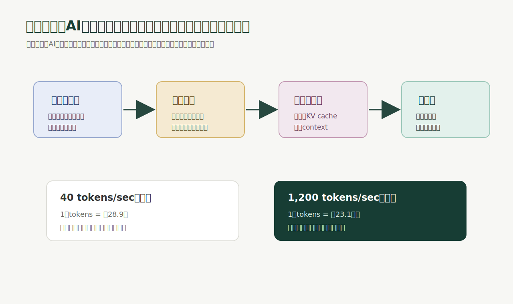
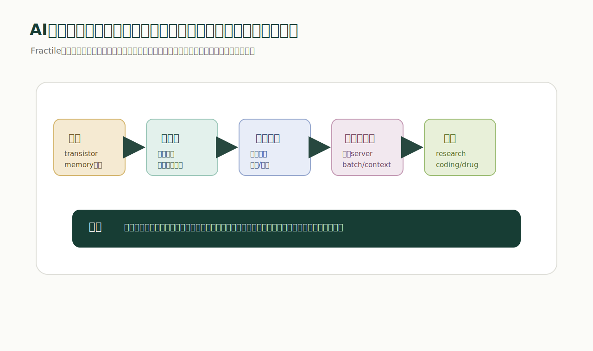

# 2026-05-20

今日は、Fractileの `Fractile raises $220M to build the next generation of inference hardware` を読んだ。

元記事: [Fractile raises $220M to build the next generation of inference hardware](https://www.fractile.ai/news/fractile-raises-220m-to-build-the-next-generation-of-inference-hardware)

Fractile公式サイト: [Fractile - Radically Accelerate Frontier Model Inference](https://www.fractile.ai/)

これは、AIチップ企業Fractileが2.2億ドルを調達したというニュースでありながら、実質的には「これからAIの価値を決めるのは、モデルそのものだけではなく、推論をどれだけ速く、安く、大量に回せるかだ」という宣言に近い記事だった。

全文を逐語訳するより、この記事が言っていることを分かりやすく意訳すると、こうなる。

AIは、学習する時代から、推論を大量に回す時代に入っている。

今までは「どれだけ賢いモデルを作れるか」が主戦場だった。でもこれからは、その賢いモデルに、どれだけ長く考えさせられるか。どれだけ多くのトークンを、どれだけ短い時間で、どれだけ安く生成できるかが主戦場になる。

Fractileは、そのための次世代推論ハードウェアを作ろうとしている。

## 記事の要点

Fractileの主張はかなり明確だった。

AIの能力が上がるほど、価値のある仕事には長い推論が必要になる。

単発で答えるだけなら、モデルを一回走らせればいい。でも、研究、ソフトウェア開発、創薬、材料探索、複雑な意思決定のような仕事では、途中で仮説を立て、検証し、失敗し、別方向を試し、最後に統合する必要がある。

これは人間の知的労働と似ている。

数学者が大量の紙に計算を書き、何度も行き止まりに入り、それでも最後に突破口を見つけるように、AIにも長い中間思考が必要になる。Fractileの記事では、Andrew Wilesのフェルマーの最終定理の例を使って、この「長い知的作業」を説明していた。

つまり、これからのAIは「すぐ答えるチャットボット」だけではなく、「何百万、何千万、場合によっては1億トークンを使って大きな問題に取り組むシステム」になっていく。

ここで問題になるのが、推論速度。

記事では、現在のチップ上で大規模モデルがだいたい40 tokens/sec程度で動くとし、1億トークンの出力には約1か月かかると説明している。

計算すると分かりやすい。

- 100,000,000 tokens ÷ 40 tokens/sec = 2,500,000秒
- 2,500,000秒 = 約28.9日

これを1日に縮めるには、だいたい1,200 tokens/secが必要になる。

- 100,000,000 tokens ÷ 1,200 tokens/sec = 約83,333秒
- 約83,333秒 = 約23.1時間

つまり、Fractileが見ている問題は「チャットの返事を少し速くする」ではない。

1か月かかるAIの知的作業を、1日や数時間に圧縮すること。

ここが一番大事なポイントだと思う。

## 推論がAI産業のエンジンになる

この記事で印象的だったのは、推論をAI産業の収益エンジンであり、同時に成長の制約でもあると見ているところ。

AIモデルを学習するには巨大な計算資源が必要だが、実際にユーザーへ価値を届けるのは推論だ。ユーザーが質問する。エージェントがコードを書く。研究仮説を試す。画像や動画を生成する。これらは全部、推論コストと推論速度に支配される。

モデルが賢くなればなるほど、1回のリクエストで使いたい計算量は増える。

短く答えるより、長く考えた方が良い成果が出る。複数の候補を試し、内部で探索し、検証し、最後にまとめる方が良い成果が出る。これは、2024年以降のreasoning modelの流れとも合っている。

ただし、長く考えるAIは高い。

しかも遅い。

だから、推論を高速化し、同時に安くするハードウェアが重要になる。

Fractileの公式サイトでは、最先端モデルの推論を最大25倍速く、コストを10分の1にすることを掲げている。これはもちろん同社の主張であり、独立した公開ベンチマークとして受け取るべきではない。ただ、彼らが狙っている市場の大きさはよく分かる。

## なぜ既存ハードウェアでは足りないのか

Fractileが問題視しているのは、メモリ帯域。

大規模モデルの推論では、計算だけでなく、重みやKVキャッシュなど大量のデータをメモリから読み書きする。モデルが大きくなり、コンテキストが長くなり、同時ユーザーが増えるほど、メモリの近さと帯域が効いてくる。

GPUは強い。

ただ、GPUは万能ではない。低レイテンシと高スループットを同時に満たすには、メモリと計算の配置そのものがボトルネックになる。

Fractileは、メモリと計算を物理的に近づけ、推論に最適化した新しいプロセッサを作ると言っている。公式サイトでは、メモリと計算を物理的に interleaved することで、低レイテンシと高スループットを同時に狙うと説明している。

ここで言っていることは、単なる「速いチップ」ではない。

ワークロードから逆算して、チップ、システム、サーバー、推論スタックまで作るという話。

## 分かりやすく言い換える

この記事をかなり噛み砕くと、こういう話になる。

AIが本当に難しい仕事をするには、たくさん考える必要がある。

たくさん考えるには、たくさんトークンを出す必要がある。

たくさんトークンを出すには、推論が速くないといけない。

でも今のハードウェアでは、推論を速くしようとすると高くなり、安くしようとすると遅くなる。

だからFractileは、推論専用にハードウェアを作り直す。

この構造。

つまり、彼らが売ろうとしているのはチップ単体ではなく、「AIが長く考えられる時間を短くする装置」だと思う。

これはかなり強い考え方。

AIの価値を「モデルの賢さ」だけで見ていない。AIの価値を「どれだけの知的作業を、どれだけ短い現実時間に圧縮できるか」で見ている。

## 私たちの見解

この記事を読んで一番強く感じたのは、AIの競争軸が変わっているということ。

これまでは、モデルそのものが中心だった。

どのモデルが賢いか。どのベンチマークで勝つか。どれだけパラメータが大きいか。どれだけ良いデータで学習したか。

もちろん、これは今後も重要。

でも、次の競争では「推論をどれだけ運べるか」がかなり重要になる。

AIエージェントが本当に仕事をするなら、1回の応答で終わらない。タスクを分解し、検索し、コードを書き、テストし、失敗し、直し、また検証する。この時、ボトルネックはモデルの知能だけではない。

現実時間がボトルネックになる。

人間が待てる時間、サーバー費用、GPU枠、メモリ帯域、同時実行数、失敗時の再実行コスト。ここが全部、AIプロダクトの上限を決める。

だから、推論ハードウェアは単なるインフラではなく、AIアプリケーションの可能性そのものを広げるレイヤーになる。

速い推論は、既存タスクを速くするだけではない。

速い推論があるから、今まで高すぎて実行できなかったタスクが実行可能になる。

ここが深い。

技術は、コストが下がると用途が変わる。用途が変わると、プロダクトも市場も変わる。Fractileの記事は、その変化を「推論」という一点から見ている。

## 疑って読むべきところ

ただし、この記事は資金調達発表でもある。

だから、冷静に見るべき点もある。

まず、25倍高速、10分の1コストという主張は、現時点では公式サイト上の主張として読むべきだと思う。顧客環境、モデル種類、コンテキスト長、バッチ、精度、ソフトウェアスタックによって結果は変わるはず。

次に、AIチップは作るだけでは勝てない。

チップ、ボード、サーバー、コンパイラ、ランタイム、モデル対応、クラウド運用、顧客導入まで全部が必要になる。Fractileはフルスタックでやると言っているが、それは強みであると同時に難しさでもある。

さらに、NVIDIAの既存エコシステムは非常に強い。

CUDA、TensorRT、GPU供給、クラウド、開発者、既存最適化の蓄積がある。新しいハードウェアが勝つには、単に速いだけでは足りない。開発者が使えて、モデルが動いて、運用できて、サポートできて、調達できる必要がある。

だから、Fractileの成功は、チップ性能だけではなく、ソフトウェアと導入体験にかかっていると思う。

## zerotryへの接続

この話は、zerotryのハードウェア開発にもかなり関係がある。

Fractileの記事の本質は「ハードウェアはワークロードから逆算して作るべき」ということだと思う。

AI推論なら、ワークロードは長い思考、長いコンテキスト、多数ユーザー、低コスト、低レイテンシ。

zerotryのRFIDやタギングラインなら、ワークロードはタグ発行、貼付、読取、検査、POS連携、在庫更新、NG排出、復旧。

どちらも、単体の部品ではなく、流れ全体が価値を決める。

zerotryがリーダーモジュール基板やタギングラインを作るなら、ただ「RFIDが読める基板」を作るだけでは弱い。

作るべきなのは、現場の作業時間を短くし、読み漏れを減らし、失敗時に復旧でき、POSや在庫データに確実につながるハードウェア。

Fractileが「1か月の推論を1日に圧縮する」ことを狙うなら、zerotryは「1日かかる棚卸しやタグ付けを数十分に圧縮する」ことを狙うべきだと思う。

ここで見るべき指標は似ている。

- 1件あたりの処理時間
- 同時に扱える件数
- 失敗率
- 復旧時間
- コスト
- 現場で待たされる時間
- ログから原因追跡できるか

AIチップも、RFIDラインも、最終的には同じ問いに戻る。

そのハードウェアは、現実世界の時間をどれだけ短くできるのか。

## 今日の結論

Fractileの記事は、AIチップ企業の資金調達ニュースとして読むだけだともったいない。

本質は、推論がAI時代のボトルネックになり、推論速度が新しいプロダクトの可能性を決めるという話。

モデルが賢くなるほど、考える時間が増える。

考える時間が増えるほど、推論ハードウェアが重要になる。

推論ハードウェアが速く安くなるほど、AIに任せられる仕事の種類が増える。

これは、AI業界だけの話ではないと思う。

どの産業でも、次に強い会社は、単にソフトウェアを書く会社ではなく、現実のボトルネックを見つけて、それをハードウェア、ソフトウェア、運用まで含めて短縮する会社になる。

zerotryも同じ。

RFID、POS、リーダー基板、タギングライン、AI、サーバー。これらを別々に見るのではなく、「現場の時間を圧縮するための推論/認識/検査/記録のパイプライン」として設計する。

Fractileの記事を読んで改めて思ったのは、ハードウェアの価値はスペック表の中にあるのではなく、現実の待ち時間をどれだけ消せるかにあるということ。

速いチップも、速いラインも、結局は時間を取り戻すための装置だ。

## 参考

- [Fractile: Fractile raises $220M to build the next generation of inference hardware](https://www.fractile.ai/news/fractile-raises-220m-to-build-the-next-generation-of-inference-hardware)
- [Fractile: Radically Accelerate Frontier Model Inference](https://www.fractile.ai/)
