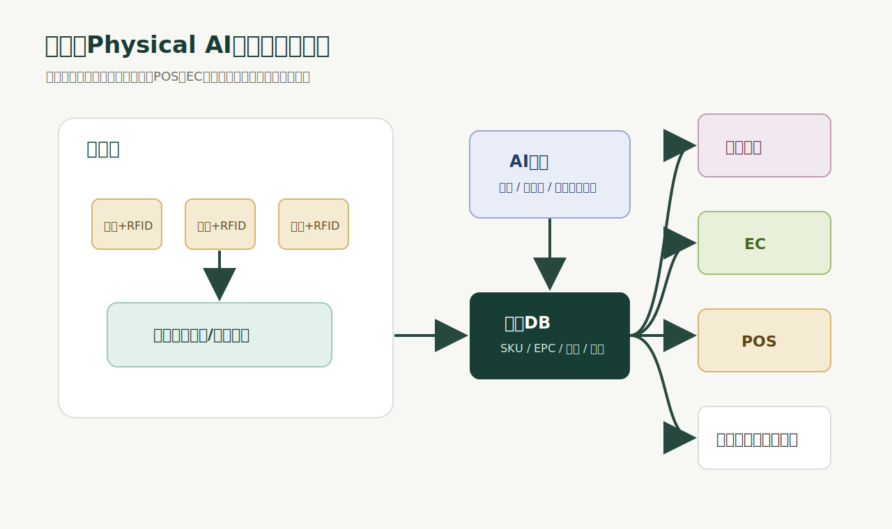
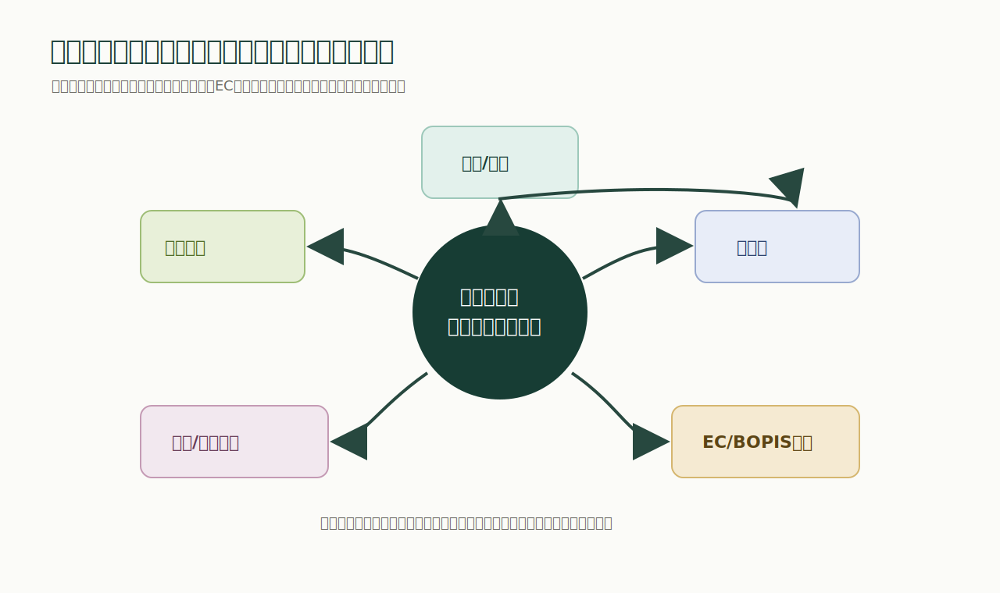
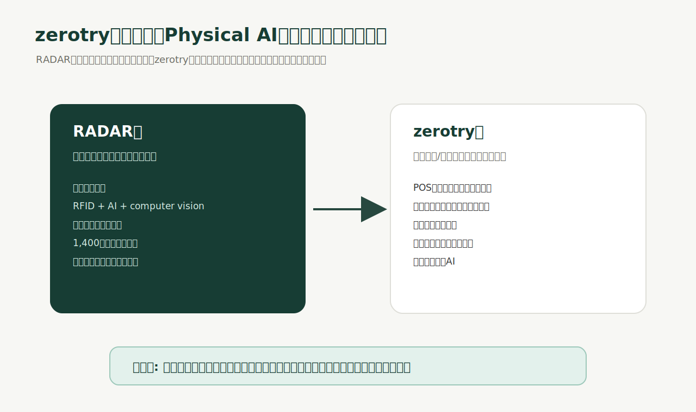

# 2026-05-20

今日は、RADARのシリーズB調達発表について考えた。

元投稿: [RADARのX投稿](https://x.com/i/status/2056731580157047078)

関連情報:

- [RADAR公式サイト](https://goradar.com/)
- [PYMNTS: Retail Tech Startup Radar Secures $170 Million Funding Round](https://www.pymnts.com/news/investment-tracker/2026/retail-tech-startup-radar-secures-170-million-funding-round/)
- [Old Navy / Gap Inc.: Old Navy Partners with RADAR](https://s204.q4cdn.com/320226404/files/doc_news/Old-Navy-Partners-with-RADAR-to-Elevate-the-Customer-Experience-with-Plans-for-Phased-Roll-Out-of-its-AI-Powered-RFID-Technology-2025.pdf)
- [Fibre2Fashion: Radar to launch new technology in American Eagle stores](https://www.fibre2fashion.com/news/textiles-technology-news/radar-to-launch-new-technology-in-american-eagle-stores-286659-newsdetails.htm)

RADARは、1億7,000万ドルのシリーズBを発表し、評価額が10億ドル以上になった。投資家にはGideon Strategic Partners、Nimble Partners、Align Venturesなどが入り、すでにAmerican Eagle Outfitters、Gap Inc.のOld Navyなど、1,400店舗以上に導入されていると報じられている。

RADARが言っていることを分かりやすく言うと、こういうことだと思う。

店舗は、まだインターネット化されていない。

ECでは、在庫数、閲覧、カート投入、購入、返品、在庫移動がデータとして見える。ところが、実店舗では「この商品が店内に本当にあるのか」「売場にあるのか、バックヤードにあるのか」「どこに置かれているのか」が分からないことが多い。

RADARは、この見えない店舗を、リアルタイムに見える店舗へ変えようとしている。

## 何が発表されたのか

2026年5月20日時点で確認できる内容は、こう。

- RADARが1億7,000万ドルのシリーズBを調達した
- 評価額は10億ドル以上になった
- Gideon Strategic PartnersとNimble Partnersが共同リードした
- Align Venturesも参加した
- すでに1,400店舗以上に展開されている
- American Eagle Outfitters、Old Navyなどの大手小売で導入されている
- 同社はリアルタイムで99%のアイテムレベル在庫精度を掲げている
- 店舗内の在庫の有無、位置、移動を可視化する

RADAR公式サイトでは、店舗内の在庫を「何があるか」「どこにあるか」までリアルタイムに把握することを中心に置いている。American Eagle導入に関する発表では、RADARはRFIDとコンピュータビジョンを組み合わせ、店舗在庫をリアルタイムに99%精度で追跡・位置特定すると説明されている。

Gap Inc.のOld Navy発表でも、RADARはRFID、AI、コンピュータビジョンを組み合わせて、店舗内在庫を高い精度でリアルタイムに追跡・特定する技術として紹介されている。

つまり、これは単なる資金調達ニュースではない。

実店舗のデータ化が、ようやく大規模に動き始めたというニュースだと思う。

## なぜ重要なのか

小売の一番大きな問題は、在庫が「あるはず」なのに売れないことだと思う。

商品は店舗にある。でも売場にない。バックヤードにある。でもスタッフが見つけられない。EC上では在庫ありになっている。でもピックアップしようとしたら見つからない。逆に在庫切れだと思って補充したら、実は店内の別の場所にあった。

こういうズレが積み重なると、機会損失、値下げ、過剰在庫、棚卸し工数、返品、盗難・紛失、顧客不満につながる。

RADARが言っている「小売業者は年間推定1兆ドルの損失を被っている」という問題の中心は、ここにある。

店舗は、商品が物理的に動く場所だ。

でも、その物理的な動きがデータ化されていない。

だから、店舗運営はまだ人間の記憶、目視、棚卸し、ハンディスキャナ、経験に依存している。

RADARの価値は、この物理空間をデータ化することにある。

## Physical AIとして見る

RADARの投稿で一番大事なのは、同社が自分たちを単なるRFID企業ではなく、Physical AIの会社として位置づけていること。

Physical AIは、現実世界をセンサーで読み取り、AIで理解し、現実世界の行動や意思決定に戻す仕組みだと思う。

チャットAIは、テキストを読んでテキストを返す。

Physical AIは、現実の状態を読んで、現実の行動を変える。

RADARの場合はこうなる。

- 商品にRFIDタグが付く
- 天井や店内のセンサーが商品を読む
- AIが在庫の位置、移動、状態を推定する
- 店舗スタッフが補充、探索、接客に使う
- ECやPOSが正しい在庫情報を使う
- 将来的には自動チェックアウトにもつながる

これを図にすると、価値の流れはかなり分かりやすい。

重要なのは、RADARが最初からロボットを動かしているわけではないこと。

まずは、店舗内の現実を正確に見る。

Physical AIの最初の仕事は、動くことではなく、見ること。

ここがかなり重要だと思う。

現実世界を正しく観測できないAIは、現実世界を変えられない。

## なぜRFIDだけでは足りなかったのか

RFID自体は新しい技術ではない。

GS1 USとMIT Auto-ID LaboratoryのRFID白書でも、RAIN RFIDタグのコスト低下や読取性能の改善が整理されている。RFIDは長く使われてきたが、店舗全体を常時リアルタイムで理解するには、タグ、リーダー、アンテナ配置、ソフトウェア、業務設計、データ連携が全部必要になる。

つまり、RFIDタグを付ければ終わりではない。

これまでのRFIDは、棚卸しを速くする技術として見られがちだった。

でもRADARが狙っているのは、棚卸しの高速化だけではない。

店舗そのものをリアルタイムのデータ空間に変えること。

そのためには、天井センサー、RFID、コンピュータビジョン、AI、店舗アプリ、POS、EC、在庫DBが一体になる必要がある。

ここでようやく、RFIDは単なるタグではなく、店舗OSの入力装置になる。

## 小売の本当のDX

小売DXという言葉はよく使われる。

でも、多くのDXは、店舗の外側だけをデジタル化していた。

ECサイト、アプリ、CRM、決済、広告、会員証、クーポン。これらは重要だが、商品そのものが店内でどこにあるかは、まだ曖昧だった。

本当の小売DXは、店舗内の商品、スタッフ、棚、バックヤード、試着室、POS、EC注文が同じリアルタイム在庫データを見ている状態だと思う。

その状態になると、できることが変わる。

- ECで「店舗受け取り可」と出した商品が本当に見つかる
- 店舗スタッフが顧客の探している商品をすぐ見つけられる
- 売場にない商品をバックヤードからすぐ補充できる
- 売れ筋なのに棚に出ていない商品を検知できる
- 店舗別の在庫配置をより正確に最適化できる
- 盗難や紛失の兆候を早く見つけられる
- 将来的に自動チェックアウトへ進める

つまり、RADARが作っているのは、店舗の検索エンジンでもある。

店内にある商品を、Google検索のように見つけられるようにする。

これができると、店舗はECに近づく。

ただし、ECになるのではない。

ECのようにデータで見える実店舗になる。

## 私たちの見解

このニュースで一番重要なのは、投資額の大きさよりも、Physical AIの入口が「ロボット」ではなく「在庫可視化」から来ていることだと思う。

Physical AIというと、ヒューマノイド、ロボットアーム、自動運転、倉庫ロボットのような派手なものを想像しがち。

でも、店舗で最初に必要なのは、人型ロボットではない。

商品がどこにあるか分かること。

これができていない状態でロボットを置いても、ロボットは何を取りに行けばいいか分からない。棚が正しいか、在庫があるか、商品が移動したかを知らなければ、動作計画以前に世界モデルが壊れている。

だから、RADARのような企業が伸びるのは自然だと思う。

Physical AIの第一段階は、身体を持つことではなく、現実世界をリアルタイムに認識すること。

そして、認識の価値が一番分かりやすいのが小売在庫。

在庫は、商品という物理物であり、売上という経済価値に直結している。1つの商品が見つからないだけで、売上、接客、EC受け取り、補充、返品、棚卸しに影響する。

だから、店舗在庫のリアルタイム化は、かなり強いユースケースだと思う。

## 疑って読むべきところ

もちろん、冷静に見るべき点もある。

まず、99%精度という数字は強いが、導入環境によって難易度は変わるはず。

アパレルはRFIDとの相性が良い。タグを付けやすく、商品単価もあり、SKUも多く、サイズ・色違いの在庫ズレが売上に直結する。一方で、金属、液体、食品、狭い棚、密集陳列では難易度が上がる。

次に、店舗全体への導入にはハードウェア工事が必要になる。

天井センサー、電源、ネットワーク、店舗レイアウト、RF設計、保守、スタッフ教育、既存POS/在庫システム連携。ここはソフトウェアSaaSより重い。

ただし、この重さは参入障壁にもなる。

一度店舗に入り、精度と運用が安定すると、簡単には置き換えにくい。ハードウェア、データ、業務フロー、店舗スタッフの習慣が一体化するから。

RADARの評価額が大きいのは、単にRFIDを読んでいるからではなく、店舗の基幹インフラになれる可能性があるからだと思う。

## zerotryへの示唆

このニュースは、zerotryにかなり直接関係する。

前に考えたように、zerotryがハードウェアを作るなら、POS横のRFIDタグ発行・読取ステーション、リーダーモジュール基板、タギングラインから始めるのが現実的だと思う。

RADARのニュースを読むと、その方向性は間違っていないと感じる。

ただし、さらに一段深く考える必要がある。

zerotryが作るべきなのは、RFIDを読む装置ではない。

現場の「どこに何があるか」をリアルタイムに近づける装置。

つまり、店舗や倉庫のPhysical AI化の入口を作ること。

RADARが天井センサーで店舗全体を見ているなら、zerotryはもっと小さく始められる。

- POS横のタグ発行ステーション
- バックヤードの検品ステーション
- 出荷前の読取ゲート
- 店舗スタッフ向けの探索アプリ
- 小規模店舗向けの安価な固定リーダー
- RFIDタグ発行と商品マスタ連携
- 読取ログから在庫ズレを見つけるAI

いきなり1,400店舗を狙う必要はない。

最初は、10店舗未満の事業者が「商品が見つからない」「棚卸しがつらい」「EC受け取りで在庫がズレる」という問題を解決すればいい。

RADARが大規模小売のPhysical AIなら、zerotryは中小小売・リユース・D2C・倉庫のPhysical AI入口を作れる。

## 今日の結論

RADARの1億7,000万ドル調達は、小売×RFIDのニュースではある。

でも、もっと大きく見ると、実店舗がPhysical AI化していく流れのニュースだと思う。

ECは最初からデータの世界だった。

実店舗は、物理の世界だった。

これからは、実店舗もデータの世界になる。

そのための入口が、商品単位のリアルタイム在庫可視化。

商品がどこにあるか分かる。いつ動いたか分かる。売場にあるか、バックヤードにあるか分かる。EC注文に使えるか分かる。スタッフが探せる。補充できる。盗難や紛失を見つけられる。自動チェックアウトにもつながる。

これができると、店舗はただの販売場所ではなく、リアルタイムに認識される物理システムになる。

RADARが評価されているのは、そこだと思う。

そしてzerotryも、ここから学ぶべきことが多い。

ハードウェアを作る目的は、かっこいい機械を作ることではない。

現場の見えないものを見えるようにし、探す時間、数える時間、間違える時間を減らすこと。

Physical AIの本質は、現実世界の不確実性を減らすことだ。

RADARのニュースは、その市場がかなり大きいことを示している。

## 参考

- [RADAR公式サイト](https://goradar.com/)
- [RADARのX投稿](https://x.com/i/status/2056731580157047078)
- [PYMNTS: Retail Tech Startup Radar Secures $170 Million Funding Round](https://www.pymnts.com/news/investment-tracker/2026/retail-tech-startup-radar-secures-170-million-funding-round/)
- [Retail Technology Innovation Hub: RADAR lands $170 million in funding](https://retailtechinnovationhub.com/home/2026/5/19/ai-powered-retail-intelligence-specialist-radar-lands-170-million-in-funding-and-hits-1-billion-valuation)
- [Fibre2Fashion: Radar to launch new technology in American Eagle stores](https://www.fibre2fashion.com/news/textiles-technology-news/radar-to-launch-new-technology-in-american-eagle-stores-286659-newsdetails.htm)
- [Gap Inc.: Old Navy Partners with RADAR](https://s204.q4cdn.com/320226404/files/doc_news/Old-Navy-Partners-with-RADAR-to-Elevate-the-Customer-Experience-with-Plans-for-Phased-Roll-Out-of-its-AI-Powered-RFID-Technology-2025.pdf)
- [GS1 US / MIT Auto-ID Laboratory: Retail's RFID Evolution](https://documents.gs1us.org/adobe/assets/deliver/urn%3Aaaid%3Aaem%3Ada983889-a64a-491c-bcb8-004f02d27ac3/GS1-US-Retails-RFID-Evolution-Whitepaper.pdf)
