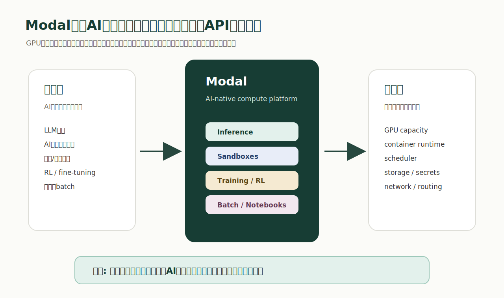
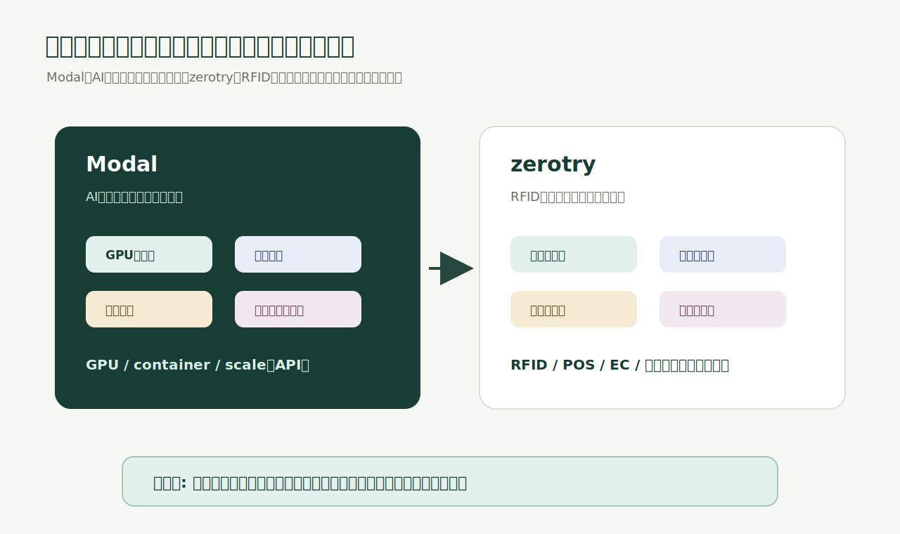

# 2026-05-23

今日は、ModalのシリーズC調達発表について考えた。

元投稿: [ModalのX投稿](https://x.com/modal/status/2057527310123770008?s=46)

元記事: [Modal's Series C: Raising $355M at a $4.65B valuation](https://modal.com/blog/modal-series-c)

関連情報:

- [Modal Docs: Introduction](https://modal.com/docs/guide)
- [Modal: Announcing our $87M Series B](https://modal.com/blog/announcing-our-series-b)
- [Reuters転載: Modal Labs valued at $4.65 billion as AI coding takes off](https://www.investing.com/news/economy-news/exclusivemodal-labs-valued-at-465-billion-as-ai-coding-takes-off-4704718)

Modalが、シリーズCで3.55億ドルを調達した。

評価額はpost-moneyで46.5億ドル。2025年9月のシリーズBでは評価額11億ドルだったので、半年強でかなり大きく伸びたことになる。

しかも今回の発表で強いのは、評価額だけではない。

- 2025年9月から売上が5倍
- 年換算売上が3億ドル超
- General CatalystとRedpointがリード
- Menlo、Bain Capital Ventures、Accelが新規参加
- 既存主要投資家も参加
- Sandboxesが売上の3分の1以上を占める

かなり強い数字だと思う。

この記事をただの大型資金調達ニュースとして読むと、少しもったいない。

本質は、AIアプリケーションが増えるほど、その下にある「AIを動かすためのインフラ」が急速に巨大化しているということだと思う。

## Modalは何をしている会社か

Modalをかなり噛み砕いて言うと、AI時代のサーバレスGPUクラウドだと思う。

AIエージェント、LLM推論、画像生成、動画生成、バッチ処理、強化学習、ファインチューニング、AI生成コードの実行環境。こういう重いAIワークロードを、開発者ができるだけ簡単にクラウドへ投げられるようにしている。

開発者は、本来ならかなり面倒なことを考えないといけない。

- GPUをどこで確保するか
- CUDAやドライバの環境をどう揃えるか
- Dockerイメージをどう作るか
- Kubernetesをどう運用するか
- GPUを使い切るにはどうスケールするか
- 推論のレイテンシをどう下げるか
- AIエージェントにコード実行環境をどう渡すか
- 使っていないGPUコストをどう抑えるか

Modalは、この複雑さをかなり抽象化している。

Modal Docsを見ると、Pythonコードの中でGPUやコンテナイメージを指定し、関数としてクラウド上で実行する形になっている。

たとえば考え方としては、こういう世界。

```python
@app.function(gpu="h100")
def run_model(prompt):
    ...
```

もちろん実際には、イメージ、依存関係、モデル、Secrets、ストレージ、スケール設定などをきちんと書く必要がある。

でも重要なのは、開発者が「GPUサーバーを立てる」ではなく「GPUを使う関数を書く」に近い感覚で進められること。

ここがModalの強さだと思う。



## なぜ伸びているのか

理由はかなりシンプルで、AI企業のほとんどがGPUと実行環境を必要としているから。

AIアプリケーションは、Webアプリよりインフラ要求が重い。

普通のWebアプリなら、リクエストを受けてDBを読み、HTMLやJSONを返す。もちろん大規模になれば難しいが、基本形はかなり成熟している。

AIアプリは違う。

1回のリクエストで、大きなモデルを読み、GPUを使い、場合によっては複数回推論し、ツールを呼び、コードを実行し、ファイルを読ませ、結果を検証し、もう一度試す。

AIエージェントになると、さらに複雑になる。

エージェントは、ただテキストを返すだけではない。ブラウザを操作する。コードを書く。テストを実行する。別プロセスを起動する。失敗したらやり直す。強化学習なら、何千、何万もの環境を並列で回す。

ここで必要になるのは、単なるGPUレンタルではない。

安全に隔離された実行環境、低レイテンシ推論、バッチ処理、学習、ログ、監視、スケール、コスト管理、権限管理まで含むAI runtimeだ。

Modalの発表で印象的だったのは、同社が自分たちを「単一用途のGPUクラウド」ではなく、AIワークロードのための汎用コンピュート基盤として位置づけていること。

ここが重要。

GPUを貸すだけなら、クラウドの一機能に見える。

でも、AI開発者が毎日触るプリミティブを押さえると、アプリケーションの作り方そのものに入り込める。

## Sandboxesが重要な理由

今回の発表で特に面白いのは、Sandboxesが売上の3分の1以上を占めているという点。

これは、AIエージェント時代のかなり大きな示唆だと思う。

AIエージェントが強くなるほど、「モデルに考えさせる」だけでは足りなくなる。

エージェントには、実際に手を動かす場所が必要になる。

- コードを書く
- コードを実行する
- テストを走らせる
- ファイルを生成する
- 外部ツールを呼ぶ
- データ変換をする
- 失敗ログを読んで修正する
- 強化学習用の環境を大量に立ち上げる

これをユーザーの本番環境で直接やらせるのは危険すぎる。

だから、隔離された実行環境が必要になる。

ModalのSandboxesは、この需要に刺さっている。AIが書いたコードや、エージェントが試す処理を、安全に、動的に、大量に実行するための場所を提供している。

これはかなり大きい。

AIエージェントは、モデルだけでは完成しない。

モデル、ツール、実行環境、権限、ログ、リトライ、監視が揃って、初めて仕事を任せられる。

Modalが伸びているのは、AIエージェントの「実行場所」を押さえているからだと思う。

## AIインフラの抽象化

今回のニュースを一言で言うなら、AIインフラの抽象化が巨大市場になっているという話。

過去の強いインフラ企業は、複雑な技術を開発者や企業が使いやすい形に変えてきた。

AWSは、サーバー調達とデータセンター運用をAPI化した。

Stripeは、決済、カード処理、請求、審査、国際展開の複雑さをAPI化した。

Vercelは、フロントエンドのデプロイ、プレビュー、CDN、ビルドの複雑さを抽象化した。

Modalは、GPU、推論、バッチ、学習、サンドボックス、AI runtimeの複雑さを抽象化している。

この流れで見ると、Modalは単なる便利な開発ツールではない。

AI時代のアプリケーションが動くための、下のレイヤーを取りに行っている会社に見える。

## 何が本当に価値なのか

Modalの価値は、「GPUが使えること」だけではないと思う。

GPUが使えるだけなら、他にも選択肢はある。

重要なのは、AI開発の摩擦を消していること。

AIアプリケーションを作るチームは、速く試したい。モデルを変えたい。推論エンジンを変えたい。バッチを回したい。GPUを一時的に増やしたい。使わない時はゼロにしたい。エージェントの実行環境を大量に立てたい。

このとき、インフラ設定に毎回時間を取られると、開発速度が落ちる。

Modalは、そこを吸収している。

つまり、売っているのはGPU時間だけではない。

AIチームの試行錯誤速度を売っている。

これはかなり強い価値。

AIの世界では、モデル、プロンプト、データ、推論設定、ツール、UXがものすごい速度で変わる。正解が固定されていない。だから、インフラが重い会社は、学習速度で負ける。

逆に、インフラの摩擦が小さい会社は、たくさん試せる。

たくさん試せる会社は、速く学べる。

この「学習速度」を支えるインフラが、Modalの本当の価値だと思う。

## AIアプリ層だけを見ていると見落とすこと

AIブームを見ると、どうしてもアプリケーションに目が行く。

AIエージェント、チャットボット、画像生成、動画生成、コーディングエージェント、営業AI、CS AI、リサーチAI。

もちろんアプリ層は大きい。

でも、その下で毎回必要になるものがある。

- GPU
- 推論基盤
- サンドボックス
- データ処理
- ベクトル検索
- モデル管理
- eval
- 権限管理
- 監視
- コスト管理
- デプロイ

ここは、AI時代のAWS層になる。

Modalは、その一部をかなり良い位置で取りに行っている。

特に強いのは、AIワークロードの形がまだ固まっていない段階で、開発者が使う抽象化を作っていること。

インフラの勝ち方は、単に安いGPUを持つことだけではない。

開発者が「これで作るのが一番早い」と感じること。

そこに入ると、アプリケーションが増えるほどインフラ側も伸びる。

## 疑って読むべきところ

もちろん、冷静に見るべき点もある。

まず、年換算売上3億ドル超という数字は非常に強いが、GPUインフラは原価も重い。売上の伸びだけではなく、粗利、GPU調達、利用率、クラウド間の容量確保、顧客集中、価格競争を見る必要がある。

次に、AIインフラは競争が激しい。

大手クラウド、GPUクラウド、推論専業、オープンソースのサービング基盤、企業の内製基盤がある。Modalが勝ち続けるには、単に便利なだけではなく、性能、信頼性、コスト、セキュリティ、権限管理、エンタープライズ対応まで伸ばす必要がある。

さらに、AIワークロードは変化が速い。

今日の中心がLLM推論でも、明日はエージェント実行環境、RL、動画生成、ロボティクス、オンデバイス連携に重心が移るかもしれない。Modalはその変化に追従する必要がある。

ただし、ここは同時に強みでもある。

ModalがGPU単体ではなく、AIワークロードのプリミティブを作っているなら、ワークロードの形が変わっても、開発者の実行基盤として残れる可能性がある。

## zerotryへの接続

このニュースは、zerotryの見せ方にもかなり示唆がある。

Modalがやっているのは、AI開発の複雑さを抽象化すること。

zerotryがやるべきなのは、RFID導入の複雑さを抽象化することだと思う。

RFID導入は、見た目以上に面倒だ。

- 商品マスタを整える
- JANやSKUとEPCを紐づける
- タグ仕様を選ぶ
- RFIDラベルを発行する
- 商品に貼る
- 貼ったタグを検査する
- リーダーを設置する
- アンテナを調整する
- 読取ログを在庫に反映する
- POSやECと連携する
- 棚卸しや入出庫の現場手順を変える
- エラー時の復旧フローを作る

これは、ただのSaaSではない。

ハードウェア、ソフトウェア、現場作業、データ連携、運用が全部つながって初めて価値が出る。

だからzerotryは、自分たちを「RFID SaaS」とだけ言うと小さく見える。

本当は、RFID導入のためのインフラを作っていると言った方がいい。

もっと言うと、物理商品の識別、追跡、在庫更新、販売、入出庫をAPI化する会社。

ここまで言えると、市場の見え方が変わる。



## zerotryは何をAPI化するのか

ModalがGPUをAPIのように使える状態にしているなら、zerotryはRFIDと現場在庫をAPIのように使える状態にする。

たとえば、現場ではこういう操作が本質になる。

- `issue_tag`: 商品にRFIDタグを発行する
- `verify_tag`: タグが正しく読めるか検査する
- `observe_item`: 商品を読取ポイントで観測する
- `move_item`: 店舗、倉庫、売場、バックヤード間の移動を記録する
- `count_inventory`: 棚卸し結果を在庫に反映する
- `resolve_mismatch`: POS、EC、現物のズレを解消する
- `retire_tag`: 販売、破棄、返品不可などでタグを終了する

この下には、RFIDプリンタ、リーダー、アンテナ、POS、EC、商品マスタ、スタッフUI、物流拠点、検品作業がある。

でも顧客が本当に欲しいのは、RFIDリーダーそのものではない。

顧客が欲しいのは、商品がどこにあるか分かること。棚卸しが早く終わること。EC在庫がズレないこと。タグ発行ミスが減ること。入出庫が正しく記録されること。

つまり、zerotryが売るべきなのは、RFID機器ではなく、現場の識別と在庫更新の抽象化。

ここがModalから学べる一番大きな点だと思う。

## 投資家にどう見えるか

投資家視点でも、この見せ方は重要。

「RFID SaaSです」と言うと、在庫管理ツールの一つに見えやすい。

「RFIDリーダーも作ります」と言うと、ハードウェア会社に見えやすい。

でも、「物理世界の商品識別と在庫イベントを抽象化するインフラです」と言うと、見え方が変わる。

これは、店舗、倉庫、EC、POS、物流、返品、棚卸し、検品、会計、分析まで広がる可能性がある。

ModalがAI開発者の実行基盤を取りに行っているなら、zerotryは小売・リユース・D2C・物流現場の識別基盤を取りに行ける。

最初の入口は小さくていい。

POS横のタグ発行ステーション。バックヤード検品。出荷前読取ゲート。店舗スタッフ向け探索アプリ。小規模店舗向け固定リーダー。

でも、入口が小さくても、抽象化する対象が大きければ、会社の見え方は大きくなる。

## 今日の結論

Modalの3.55億ドル調達は、AIインフラ企業の大型ラウンドというニュースではある。

でも本質は、AI時代に「複雑な技術を、開発者がすぐ使える形に抽象化する会社」が巨大化しているということだと思う。

AI企業はGPUを必要としている。

でも、GPUだけでは足りない。

推論、学習、サンドボックス、バッチ、スケール、コスト管理、セキュリティ、権限、監視が必要になる。

Modalは、その複雑さを開発者が扱いやすいプリミティブに変えている。

だから伸びている。

そして、この構造はzerotryにもそのまま当てはまる。

RFID導入も、タグを貼れば終わりではない。

EPC、商品マスタ、POS、EC、リーダー、アンテナ、棚卸し、入出庫、検品、例外処理、現場教育、ログ、復旧まで全部が必要になる。

zerotryが狙うべきなのは、RFIDを売ることではなく、RFID導入と現場在庫運用の複雑さを抽象化すること。

AIの世界では、ModalがGPUと実行環境をAPI化している。

物理小売の世界では、zerotryが商品識別と在庫イベントをAPI化できる。

この見方をすると、zerotryは単なるRFID SaaSではなく、物理世界の識別インフラになれる。

今日のModalのニュースから学ぶべきなのは、ここだと思う。

大きな会社は、複雑なものを小さく見せる。

Modalは、AIインフラを関数に近づけた。

zerotryは、RFIDと現場在庫をイベントに近づけるべきだ。
