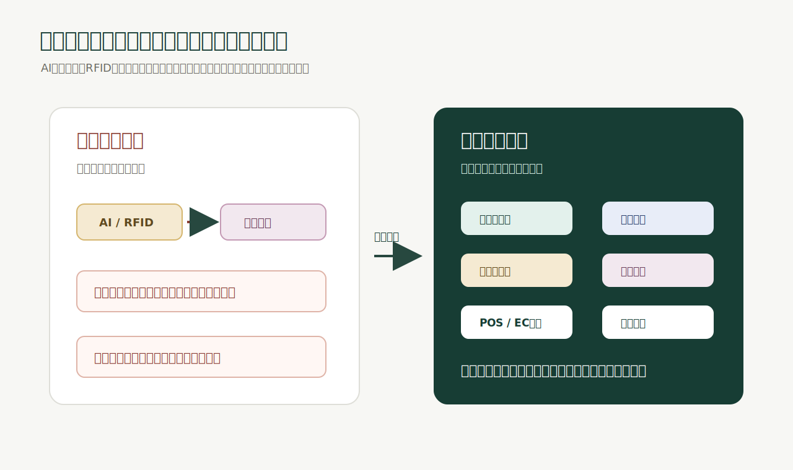

# 2026-05-23

今日は、スターバックスが北米店舗で導入していたAI在庫管理ツールを9カ月で廃止したニュースについて考えた。

元記事: [GIGAZINE: スターバックスがAI在庫管理ツールを導入から9カ月で廃止、ミス多発のため](https://gigazine.net/news/20260522-starbucks-abandons-ai-inventory-tool/?utm_source=x&utm_medium=sns&utm_campaign=x_post&utm_content=20260522-starbucks-abandons-ai-inventory-tool)

関連情報:

- [Reuters転載: Starbucks scraps AI inventory tool across North America](https://www.marketscreener.com/news/starbucks-scraps-ai-inventory-tool-across-north-america-ce7f5aded18ffe2d)
- [NomadGo: Inventory AI Brings Automated Counting to More than 11,000 Starbucks Locations](https://www.nomad-go.com/news-pr/nomadgos-inventory-ai-brings-automated-counting-to-more-than-11-000-starbucks-locations)
- [Reuters転載: Starbucks rolls out AI for inventory counting](https://www.investing.com/news/stock-market-news/starbucks-rolls-out-ai-for-inventory-counting-4222255)

スターバックスが、北米店舗で使っていたAI在庫管理ツール `Automated Counting` を廃止した。

このツールは、NomadGoと組んで導入されたもので、タブレットやスマートフォンのカメラ、LiDAR、3D空間認識、コンピュータビジョンを使って、牛乳、シロップ、コーヒー豆などの在庫を自動で数える仕組みだった。

2025年9月の発表時点では、北米の11,000以上のスターバックス店舗へ大規模展開され、手作業より最大8倍速く、99%精度で在庫カウントできると説明されていた。

でも、現場ではうまくいかなかった。

Reutersによると、似た種類のミルクを取り違えたり、棚にある商品を見落としたり、品目名を誤って認識したりする問題が起きていた。GIGAZINEの記事でも、デモ動画の時点でペパーミントのボトルがカウントされていない場面に触れられていた。

結果として、導入から9カ月で自動カウントをやめ、手動管理へ戻すことになった。

これはかなり重要なニュースだと思う。

なぜなら、これは「AIが在庫を数えられなかった」という話ではなく、「現実世界の在庫管理を自動化する難しさ」が表に出た話だから。

そして、この構造はRFID導入でもまったく同じ。

## 技術が正しくても、導入は失敗する

AI在庫管理も、RFIDも、単体の技術として見ると魅力は分かりやすい。

AIなら、カメラを向けるだけで商品数が分かる。

RFIDなら、バーコードのように1点ずつ読まなくても、複数の商品をまとめて読める。

どちらも、現場の棚卸し、入出庫、補充、欠品確認を速くできる可能性がある。

でも、現実の導入はそんなに単純ではない。

店舗や倉庫の在庫管理は、きれいなデモ環境ではなく、汚れた現場で動く。

- 商品が似ている
- パッケージが変わる
- 棚が狭い
- 商品が重なる
- 液体や金属がある
- スタッフごとに置き方が違う
- POSとECと在庫管理システムの数字がズレている
- 商品マスタが不完全
- 例外処理が決まっていない
- 読み取れなかった時の復旧フローがない

この状態で「AIが自動で数えます」「RFIDで一括読取できます」と言っても、現場では止まる。

技術が悪いというより、技術だけを入れても現場の業務にはならない。

ここが一番大事だと思う。

## 99%精度の落とし穴

今回のニュースで象徴的なのは、NomadGo側の発表では99%精度が掲げられていたこと。

99%という数字だけを見ると、かなり高く見える。

でも、在庫管理では1%のズレが現場に大きく跳ね返る。

たとえば、100個の商品を数えて1個間違うだけなら軽く見えるかもしれない。でも、その1個が欠品しやすい人気商品だったり、EC在庫と連動していたり、発注判断に使われたりすると、影響は大きい。

しかも、在庫管理のエラーは平均値ではなく、偏りが問題になる。

特定の商品だけ誤認識しやすい。特定の棚だけ読み取りにくい。特定の店舗レイアウトだけ失敗しやすい。特定のスタッフの作業手順だとズレやすい。

この偏りを潰せないまま全店展開すると、現場は「また間違っている」と感じる。

一度そうなると、ツールへの信頼が落ちる。

信頼が落ちると、スタッフは手動で確認する。

手動で確認するなら、最初から手で数えた方が早いという判断になる。

自動化ツールが失敗するときは、だいたいここで負ける。

## AI在庫管理とRFIDの共通点

AI在庫管理とRFIDは別の技術に見える。

AI在庫管理は、カメラやLiDARで商品を認識する。

RFIDは、商品に付いたタグを電波で読む。

でも、導入で失敗するポイントはかなり似ている。

まず、商品マスタが必要になる。

何を読んだのか。どの商品なのか。SKU、JAN、EPC、サイズ、色、店舗、ロケーション、状態をどう紐づけるのか。ここが曖昧だと、読取結果を在庫に変換できない。

次に、現場作業が必要になる。

AIなら、スタッフがどの角度から、どの距離で、どの順番でスキャンするかが結果に影響する。RFIDなら、タグをどこに貼るか、いつ発行するか、検品時にどう読ませるか、どのタイミングで在庫更新するかが結果に影響する。

さらに、例外処理が必要になる。

読めなかった商品をどう扱うか。重複して読んだ商品をどう消すか。別店舗の商品が混ざったらどうするか。返品、破損、タグ剥がれ、タグなし商品、既存タグ付き商品をどう処理するか。

ここを決めないまま導入すると、現場は例外のたびに止まる。

そして最後に、検証が必要になる。

読取率、誤読率、未読率、作業時間、在庫差異、スタッフの修正回数、復旧にかかった時間。これを継続的に見ないと、導入が成功しているのか、現場が我慢しているだけなのか分からない。

## RFIDはタグを貼れば終わりではない

RFID導入で一番危ない誤解は、タグを貼ってリーダーを置けば在庫が正しくなる、という考え方。

実際には、RFID導入にはかなり多くの設計がある。

- 商品マスタを整える
- JAN、SKU、EPCを紐づける
- タグ仕様を選ぶ
- RFIDラベルを発行する
- 商品にタグを貼る
- タグが正しく読めるか検査する
- リーダーとアンテナを配置する
- 電波の読み取り範囲を調整する
- 入庫、出庫、棚卸し、返品、店舗間移動のフローを設計する
- POS、EC、在庫管理システムと連携する
- エラー時の復旧フローを作る
- 現場スタッフが迷わないUIにする
- 導入後のデータを見て改善する

この一つ一つを飛ばすと、どこかで破綻する。

RFIDは魔法ではない。

ただし、正しく設計すればかなり強い。

バーコードでは1点ずつ読み取る必要がある作業を、RFIDなら一括で読み取れる。売場、バックヤード、物流拠点、POS、ECをまたいで、商品単位の状態を追いやすくなる。

でも、その価値は「読める」だけでは出ない。

読んだ結果が、正しい在庫イベントとして業務に反映されて初めて価値になる。

## 導入を成功させる会社の価値

今回のスターバックスのニュースから学ぶべきことは、技術選定よりも導入設計の重要性だと思う。

現実世界の自動化は、ソフトウェアを配布するだけでは終わらない。

店舗に入り、倉庫に入り、棚を見て、商品を見て、既存システムを見て、スタッフの動きを見て、例外を見て、運用に落とす必要がある。

AIでもRFIDでも、導入の勝負はここにある。

弊社がRFID導入で持っている知見も、まさにこの部分。

RFIDリーダーを売るだけではなく、タグ発行、商品マスタ、検品、入庫、出庫、棚卸し、POS連携、EC連携、タグなし商品の扱い、既存タグ商品の扱い、現場スタッフの操作体験まで含めて、導入が回る状態を作る。

つまり、売っているのはRFID機器ではない。

RFIDを現場で使える状態にする導入知見。

ここに価値がある。

## zerotryへの示唆

zerotryがやるべきことは、今回のニュースでより明確になったと思う。

RFIDを「すごい技術」として売るのではなく、「失敗しがちなRFID導入を成功させる仕組み」として売るべき。

顧客が本当に欲しいのは、タグでもリーダーでもない。

顧客が欲しいのは、棚卸しが早く終わること。EC在庫がズレないこと。入庫と出庫が正しく記録されること。商品がどこにあるか分かること。店舗スタッフが迷わないこと。導入しても現場が壊れないこと。

そのためには、技術と業務をつなぐ会社が必要になる。

ここがzerotryの立ち位置だと思う。

AI在庫管理の失敗は、RFIDの追い風にもなる。

なぜなら、小売や物流の現場は、これからも在庫の自動化を求めるから。手作業に戻ればいい、という話ではない。人手不足、EC連携、店舗受け取り、返品、複数拠点運用が進むほど、現物在庫を正しく把握する必要は強くなる。

ただし、次に導入する会社は慎重になる。

「本当に現場で動くのか」

「既存システムとつながるのか」

「例外処理まで考えているのか」

「導入後に数字で改善できるのか」

この問いに答えられる会社が選ばれる。

だから、zerotryは単なるRFID SaaSではなく、RFID導入を成功させる会社として見せるべきだと思う。

## 今日の結論

スターバックスのAI在庫管理ツール廃止は、AIブームへの冷や水というより、現実世界の自動化には導入設計が必要だという当たり前の確認だと思う。

現場は複雑だ。

棚はきれいに並ばない。商品は似ている。マスタはズレる。スタッフの動きは一定ではない。例外は必ず起きる。

だから、AIでもRFIDでも、技術単体では失敗する。

成功するために必要なのは、技術、データ、現場作業、例外処理、既存システム連携、検証指標をまとめて設計すること。

RFIDも同じ。

タグを貼るだけでは導入は成功しない。

リーダーを置くだけでも成功しない。

RFIDを現場の在庫イベントとして使える状態にして、初めて価値が出る。

弊社には、その導入を成功させるための知見がある。

スターバックスのニュースは、在庫自動化の終わりではない。

むしろ、在庫自動化を本当に成功させる会社が必要になるというサインだと思う。
