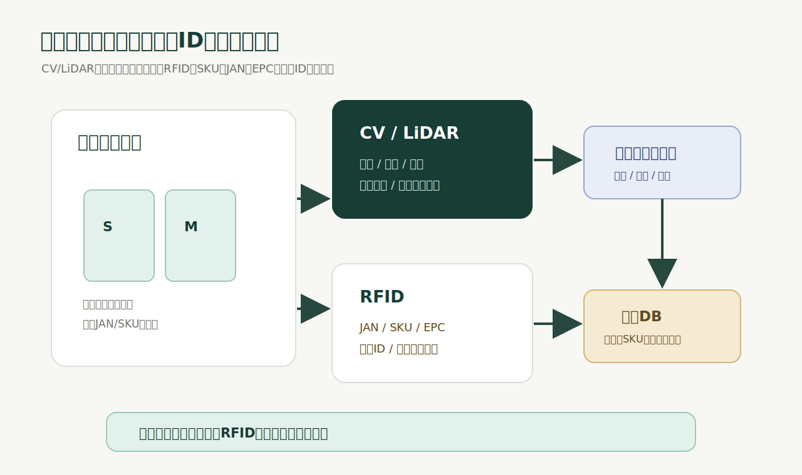

# 2026-05-23

今日は、ヒューマノイドロボット時代の在庫管理について考えた。

結論から言うと、私は、在庫管理の主役はComputer VisionやLiDARではなくRFIDになると思っている。

もっと正確に言うと、ロボットの認識と操作にはComputer VisionやLiDARが必要になる。でも、在庫管理の正本、つまり「その商品が何で、どのSKUで、どの個体で、どの在庫イベントに紐づくのか」を確定するレイヤーはRFIDになると思う。

これは、AIが弱いからではない。

むしろ逆で、AIやヒューマノイドが強くなるほど、物理世界には機械が読めるIDが必要になる。

関連情報:

- [GS1 US: What is RFID Inventory Management?](https://www.supplychain.gs1us.org/rfid/what-is-rfid-inventory-management)
- [GS1 Australia: EPC/RFID](https://www.gs1au.org/standards/barcodes/epc-rfid)
- [RAIN Alliance: What is RAIN](https://therainalliance.org/what-is-rain/)
- [arXiv: Exploring Fine-grained Retail Product Discrimination with Zero-shot Object Classification Using Vision-Language Models](https://arxiv.org/abs/2409.14963)
- [arXiv: PRISM: Product Retrieval In Shopping Carts using Hybrid Matching](https://arxiv.org/abs/2509.14985)
- [GIGAZINE: スターバックスがAI在庫管理ツールを導入から9カ月で廃止、ミス多発のため](https://gigazine.net/news/20260522-starbucks-abandons-ai-inventory-tool/)

## 在庫管理は「見えること」ではなく「識別できること」

在庫管理で一番大事なのは、商品が見えることではない。

商品を識別できること。

この違いはかなり大きい。

Computer Visionは、画像から「これは何に見えるか」を推定する。LiDARは、距離、形状、位置、周辺構造を取る。ヒューマノイドロボットにとって、これは非常に重要だ。

棚の前に立つ。商品を見つける。手を伸ばす。掴む。置く。避ける。移動する。

この一連の動作には、視覚と3D認識が必要になる。

でも、在庫管理で必要なのはそこから一段違う。

- これはどのJANの商品か
- これはどのSKUか
- Sサイズか、Mサイズか
- 同じ型番の色違いか
- 旧パッケージか、新パッケージか
- 返品された個体か
- すでに販売済みの個体か
- どの店舗から移動してきた個体か
- どの在庫イベントに紐づく個体か

これは「見た目」だけの問題ではない。

在庫管理は、物体認識ではなく、業務上のID管理だ。

## SサイズとMサイズ問題

一番分かりやすいのが、同じ品番だけどJANが違う商品。

たとえば、同じデザインの服が並んでいる。

SサイズとMサイズ。

見た目はほとんど同じ。畳まれていたら、外形差すらほぼ分からない。ハンガーに掛かっていても、角度、重なり、照明、棚位置によってはサイズ表記が見えない。

このとき、Computer VisionやLiDARは何を見るのか。

画像は、似た服を見ている。

LiDARは、似た形状を見ている。

AIは、似たパターンを見ている。

でも、在庫管理が知りたいのは「似ている服」ではない。

Sサイズが1点あるのか、Mサイズが1点あるのか。

ここを間違えると、在庫管理は成立しない。

ECではMサイズが在庫ありになっている。でも実際に店頭にあるのはSサイズだった。店舗受け取り注文が入った。ヒューマノイドが取りに行った。見た目で似た商品を掴んだ。でもJANが違う。

これは、業務上は完全に間違いだ。

ロボットが商品を掴めたかどうかではなく、正しいSKUを取れたかどうかが問題になる。

## AIは不可視のIDを推論できない

ここで大事なのは、AIの賢さの問題ではないということ。

AIは、入力された情報から推論する。

入力にIDの情報がなければ、AIはIDを確定できない。

サイズタグが見えているなら、OCRや画像認識で読めるかもしれない。パッケージにJANが見えているなら、カメラでバーコードを読めるかもしれない。服の寸法差が十分に大きく、広げた状態で、正面から見えていれば、サイズを推定できるかもしれない。

でも、現場ではそうならない。

商品は重なる。タグは裏に回る。棚は暗い。パッケージは反射する。スタッフが置き方を変える。顧客が戻す。旧ラベルと新ラベルが混在する。EC専用品と店舗品が混ざる。返品品が入る。

この状態で、画像だけから業務上のIDを確定するのは無理がある。

研究としても、Retail Product Recognitionはかなり難しい領域だ。MIMEXの論文では、商品入れ替えが多いスマートリテールではゼロショット分類が必要になる一方、既存のVision-Language Modelの細粒度分類性能は満足できる水準ではないと報告されている。PRISMの論文でも、小売商品検索は、同じ種類の商品が非常に似た見た目を持ち、撮影角度も変わるため難しいと説明されている。

つまり、最先端の視覚モデルでも、SKUレベルの細粒度識別は簡単ではない。

さらに言うと、仮にAIがかなり当てられるようになっても、在庫管理では「たぶんMサイズ」は使いにくい。

在庫は会計、販売、EC、発注、返品、監査につながる。

ここでは、確率ではなく、識別子が必要になる。

## RFIDは見た目ではなくIDを読む

RFIDの強さは、見た目を推定しないことにある。

タグにIDが入っている。

リーダーは、そのIDを読む。

これだけ。

GS1 USは、RFIDを在庫管理に使うと、商品やパレットに付いたタグがリーダーへ情報を自動送信し、商品IDをリアルタイムに取得できると説明している。GS1 Australiaも、EPC/RFIDでは複数商品を視認線なしで読み取れ、ユニークなEPCを個別のRAIN RFIDタグにエンコードすれば、個体識別子を高速・遠距離で取得できると説明している。

RAIN Allianceも、RAIN RFIDは商品タイプを超えて個別アイテムを識別でき、直接見えなくても位置や識別ができ、多数の商品を素早く読める技術だと整理している。

ここが、Computer Visionとの決定的な違い。

Computer Visionは、画像から「これは何に見えるか」を推定する。

RFIDは、タグから「これは何として登録されているか」を読む。

在庫管理に必要なのは後者。

## ヒューマノイドが来るほどRFIDが必要になる

ヒューマノイドロボットの時代になると、在庫管理はますますRFID寄りになると思う。

なぜなら、ロボットは現場で物理作業をするから。

ロボットが棚卸しする。補充する。ピッキングする。返品を仕分ける。バックヤードから売場へ商品を持ってくる。EC注文の商品を探す。

このときロボットに必要なのは、2つの認識。

1つ目は、身体を動かすための認識。

棚がどこにあるか。商品がどこに置かれているか。手をどこに入れるか。どの角度で掴むか。人や障害物がどこにいるか。

ここはComputer Vision、LiDAR、深度センサー、触覚、ロボット制御の領域。

2つ目は、業務を正しく進めるための認識。

どのSKUを取るのか。どの個体を入庫したのか。どの商品が売場に移動したのか。どの返品品が検品済みなのか。どのタグが未登録なのか。

ここはRFIDの領域。

ヒューマノイドは、目で見て手で掴む。

でも、在庫台帳はタグで確定する。

この役割分担になると思う。

## 「AIよりRFID」というより「AIのためにRFID」

タイトルとしては「在庫管理はAIよりRFID」と言いたい。

でも、正確には、AIとRFIDは競合ではない。

RFIDは、AIが使う現実世界のIDレイヤーになる。

AIは、RFIDイベントを見て判断する。

- この棚にあるべきSKUがない
- バックヤードにあるのに売場に出ていない
- EC在庫ありなのに売場にもバックヤードにも読めない
- 返品品が検品前エリアから出ている
- 他店舗の商品が混ざっている
- 同じEPCが不自然な場所で読まれている
- ピッキング対象と違うSKUをロボットが掴んだ

こういう判断はAIが得意になる。

ただし、その前提として、現実世界のイベントがID付きで取れている必要がある。

RFIDは、AIの代わりではない。

AIが現実世界を正しく扱うための入力になる。

## Computer Visionが勝つ領域、RFIDが勝つ領域

誤解してはいけないのは、Computer Visionが不要になるわけではないこと。

むしろ、ヒューマノイド時代にはComputer Visionは必須になる。

ただし、役割が違う。

Computer Visionが強いのは、位置、姿勢、形状、空間理解、異常検知、作業支援。

- 商品が棚のどこにあるか
- 人が近くにいるか
- 掴める向きか
- 落下しそうか
- 棚が乱れているか
- 空きスペースがあるか
- ロボットの手が届くか

RFIDが強いのは、ID、SKU、個体、在庫イベント、履歴、照合。

- その商品はどのJANか
- どのSKUか
- どの個体か
- 入庫済みか
- 販売済みか
- 返品済みか
- どの店舗の商品か
- 在庫台帳と一致しているか

つまり、CV/LiDARはロボットの目。

RFIDは在庫の戸籍。

目だけでは戸籍は分からない。

戸籍だけでは物を掴めない。

だから両方必要になる。

ただし、在庫管理の正本はRFID側に置くべきだと思う。

## RFIDにも弱点はある

もちろん、RFIDも万能ではない。

タグを貼る必要がある。タグコストがかかる。商品マスタとEPCを紐づける必要がある。金属や液体では読取設計が難しくなる。アンテナ配置、電波の回り込み、読取範囲、誤読、未読、タグ破損、タグなし商品、既存タグ商品の扱いを設計しないといけない。

ここを軽く見ると、RFID導入も失敗する。

だから、RFIDは魔法ではない。

でも、在庫管理に必要な「IDを読む」という問題に対しては、Computer Visionより筋が良い。

AIで見た目を推定してIDに変換するより、最初からIDを商品に持たせた方がいい。

これは技術思想の違いだと思う。

見た目からIDを当てるのか。

IDを直接読むのか。

在庫管理では、後者の方が強い。

## zerotryへの示唆

zerotryがやるべきことは、RFIDをロボット時代の在庫IDレイヤーとして位置づけることだと思う。

RFIDは、単なる棚卸し高速化ツールではない。

ヒューマノイド、AIエージェント、店舗スタッフ、POS、EC、物流拠点が同じ現物IDを見るための基盤になる。

ロボットが商品を掴む前に、近くのタグを読む。

掴んだ後に、もう一度タグを読む。

POS横でタグを失効する。

返品時にタグを再確認する。

入庫時にEPCと商品マスタを紐づける。

棚卸し時に理論在庫と実在庫を突き合わせる。

このイベントが全部つながると、店舗や倉庫はロボットが働ける空間になる。

重要なのは、ロボットを導入する前に、商品側が機械可読になっていること。

人間だけが働く店舗なら、曖昧さを人間が吸収できる。

でも、ロボットが働く店舗では、曖昧さはシステムエラーになる。

だから、ヒューマノイド時代の前提として、商品にIDが付く。

そのIDを読むインフラがRFIDになる。

## 今日の結論

ヒューマノイド時代の在庫管理は、Computer VisionではなくRFIDが担うと思う。

Computer VisionとLiDARは、物を見つけ、位置を把握し、ロボットの身体を動かすために必要になる。

でも、在庫管理で必要なのは、見た目ではなくID。

同じ品番でJANが違う商品、SサイズとMサイズ、色違い、旧パッケージと新パッケージ、返品品と通常品。こういう差分は、見た目だけでは安定して確定できない。

在庫管理は「似ているものを当てる」仕事ではない。

正しいSKU、正しい個体、正しい在庫イベントを確定する仕事だ。

AIがどれだけ賢くなっても、見えていないIDは読めない。

LiDARがどれだけ高性能になっても、形状が同じ商品のJANは分からない。

だから、商品そのものに機械が読めるIDを持たせる必要がある。

その現実的な答えがRFID。

AIよりRFID、というより、AIが現実世界で正しく働くためにRFIDが必要になる。

ヒューマノイドが店舗や倉庫で働く未来ほど、RFIDは地味だけど重要なインフラになる。
